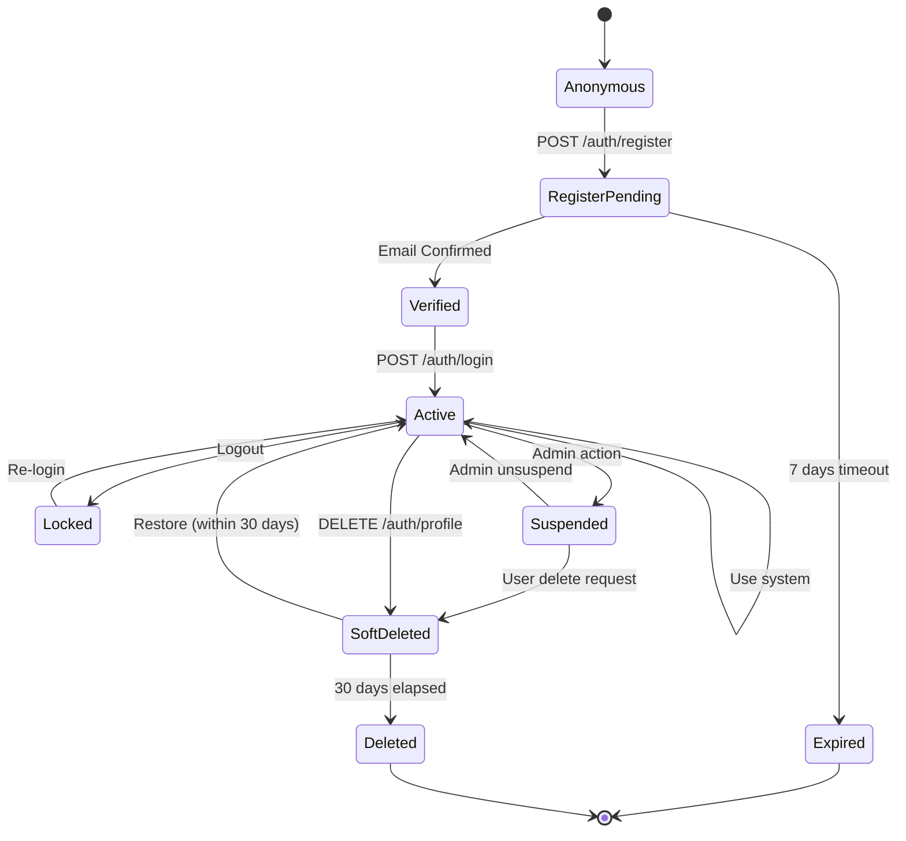
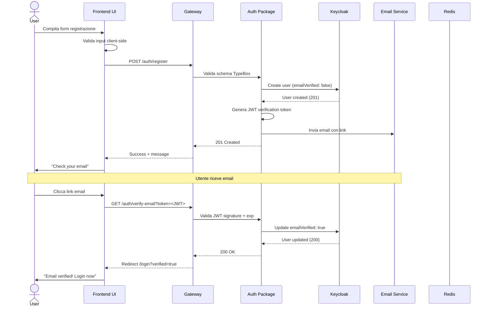
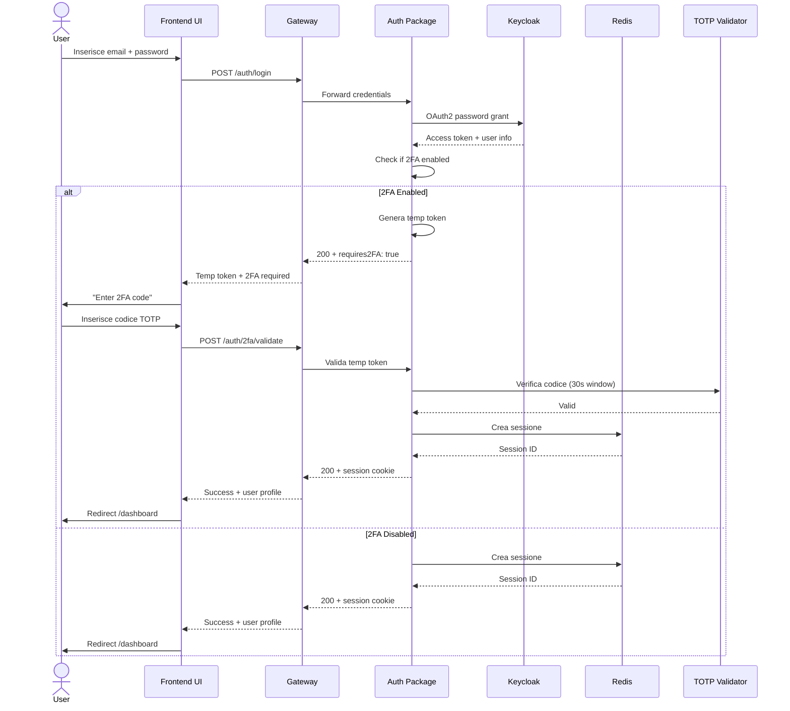
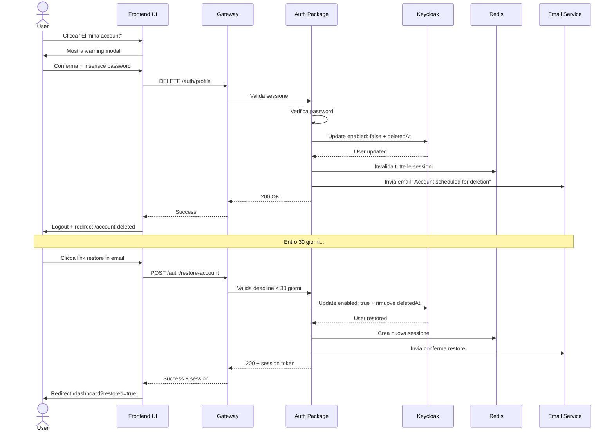

# User Lifecycle Analysis - Backend Requirements for UI

**Project**: Tech Citizen Software Gateway  
**Date**: 2025-12-11  
**Status**: Draft  
**Purpose**: Analisi completa dei flussi utente per identificare requisiti backend necessari all'integrazione UI

---

## 1. Executive Summary

### Obiettivo

Mappare tutti i casi d'uso del ciclo di vita utente (registrazione → cancellazione definitiva) per identificare:

- **Endpoint backend mancanti** necessari per l'UI
- **Gap di sicurezza** (CSRF, rate limiting, validazione input)
- **Gestione errori** lato client
- **Stati intermedi** (pending verification, soft delete, etc.)

### Scope

- ✅ **In Scope**: Autenticazione, autorizzazione, gestione profilo, cancellazione account
- ❌ **Out of Scope**: Business logic specifica (paziente, medico, cartella clinica)
- 🎯 **Focus**: Gateway + Auth Package + Keycloak integration

---

## 2. User Persona & Context

### Primary Persona: Healthcare Professional (Doctor/Nurse)

**Context**: Sistema healthcare multi-tenant con ruoli RBAC

**Caratteristiche**:

- Email aziendale richiesta (es. `mario.rossi@hospital.it`)
- Verifica email obbligatoria prima dell'accesso
- Dati sensibili (GDPR compliance)
- Sessioni sicure con scadenza automatica
- Audit trail completo delle azioni

---

## 3. User Journey Map

### 3.1 Journey Overview

```
┌─────────────────────────────────────────────────────────────────────┐
│                        USER LIFECYCLE STAGES                         │
├─────────────────────────────────────────────────────────────────────┤
│                                                                      │
│  1. ANONYMOUS    →  2. REGISTERED   →  3. VERIFIED   →  4. ACTIVE  │
│     (Guest)          (Pending)          (Enabled)        (Logged)   │
│                                                                      │
│                      ↓                                               │
│                                                                      │
│                   5. SUSPENDED  →  6. SOFT_DELETED  →  7. DELETED  │
│                      (Temp)          (30 days)          (Forever)   │
│                                                                      │
└─────────────────────────────────────────────────────────────────────┘
```

### 3.2 State Machine Diagram



---

## 4. Use Cases Dettagliati

### UC-001: Registrazione Utente

**Actor**: Anonymous User  
**Preconditions**: Nessuna  
**Trigger**: Click su "Registrati" nella UI

**Main Flow**:

1. User compila form registrazione:
   - Email (aziendale, validata)
   - Password (min 12 char, uppercase, lowercase, number, special)
   - Nome completo
   - Ruolo iniziale (default: `practitioner`)
   - Accettazione Privacy Policy + Terms of Service
2. System valida input (client-side + server-side)
3. System invia `POST /auth/register` al Gateway
4. Gateway → Auth Package → Keycloak crea utente in stato `PENDING_VERIFICATION`
5. System invia email di conferma con token JWT (exp: 7 giorni)
6. System ritorna HTTP 201 con messaggio "Check your email"
7. User riceve email con link: `https://app.example.com/verify-email?token=<JWT>`

**Postconditions**:

- User creato in Keycloak con `emailVerified: false`
- Audit log: `USER_REGISTERED`

**Alternative Flows**:

- **AF-001a**: Email già registrata → HTTP 409 Conflict
- **AF-001b**: Password debole → HTTP 400 con dettagli errori
- **AF-001c**: Rate limit superato (5 tentativi/ora) → HTTP 429
- **AF-001d**: Keycloak non disponibile → HTTP 503 retry-after

**Edge Cases**:

- **EC-001a**: Email con caratteri speciali (IDN) → Normalizzazione
- **EC-001b**: Registrazione simultanea stesso email → Lock ottimistico
- **EC-001c**: Token email scaduto dopo 7 giorni → Reinvio disponibile

---

### UC-002: Conferma Email

**Actor**: Registered User (Pending)  
**Preconditions**: UC-001 completato, token valido  
**Trigger**: Click su link email

**Main Flow**:

1. User clicca link `GET /auth/verify-email?token=<JWT>`
2. System valida JWT (signature, expiration, issuer)
3. System estrae `user_id` dal payload
4. System aggiorna Keycloak: `emailVerified: true`
5. System reindirizza a `/login?verified=true`
6. UI mostra messaggio successo: "Email verified! You can now login"

**Postconditions**:

- User abilitato per login
- Audit log: `EMAIL_VERIFIED`

**Alternative Flows**:

- **AF-002a**: Token scaduto → Pagina "Token expired" con bottone "Resend"
- **AF-002b**: Token già usato → HTTP 400 "Email already verified"
- **AF-002c**: Token manomesso → HTTP 401 "Invalid token"

**Edge Cases**:

- **EC-002a**: Verifica dopo login (edge race condition) → Success silenzioso
- **EC-002b**: Token cliccato 2+ volte → Idempotenza garantita

---

### UC-003: Login

**Actor**: Verified User  
**Preconditions**: Email verificata  
**Trigger**: Submit form login

**Main Flow**:

1. User compila form:
   - Email
   - Password
   - (Optional) Remember me checkbox
2. System valida formato email/password
3. System invia `POST /auth/login` con body:
   ```json
   {
     "username": "mario.rossi@hospital.it",
     "password": "SecureP@ssw0rd123",
     "rememberMe": false
   }
   ```
4. Gateway → Auth Package verifica credenziali con Keycloak
5. Keycloak ritorna access_token (JWT, exp: 5 min) + refresh_token (exp: 30 giorni se rememberMe)
6. Auth Package crea sessione Redis:
   - Key: `session:{session_id}`
   - Value: `{ user_id, email, roles, exp }`
   - TTL: 30 min inattività
7. System setta cookie HTTP-only:
   - `session_id` (secure, sameSite: strict)
   - `access_token` (exp: 5 min)
   - `refresh_token` (exp: 30 giorni, optional)
8. System ritorna HTTP 200 con user profile:
   ```json
   {
     "id": "uuid",
     "email": "mario.rossi@hospital.it",
     "name": "Mario Rossi",
     "roles": ["practitioner"],
     "permissions": ["read:patients", "write:notes"]
   }
   ```
9. UI reindirizza a `/dashboard`

**Postconditions**:

- Sessione attiva in Redis
- Access token valido
- Audit log: `USER_LOGGED_IN`

**Alternative Flows**:

- **AF-003a**: Credenziali errate → HTTP 401, counter incrementato (max 5)
- **AF-003b**: Account bloccato (5 tentativi) → HTTP 403 "Account locked for 15 min"
- **AF-003c**: Email non verificata → HTTP 403 "Please verify your email first"
- **AF-003d**: Password scaduta (90 giorni) → HTTP 403 "Password expired, reset required"

**Edge Cases**:

- **EC-003a**: Login da device diverso → Sessioni multiple consentite (max 3)
- **EC-003b**: Token refresh durante navigazione → Trasparente, no re-login
- **EC-003c**: Sessione scaduta durante operazione → HTTP 401, redirect /login con returnUrl

---

### UC-004: Logout

**Actor**: Authenticated User  
**Preconditions**: Login attivo  
**Trigger**: Click "Logout"

**Main Flow**:

1. User clicca "Logout"
2. UI conferma azione (modal: "Are you sure?")
3. System invia `POST /auth/logout` con session cookie
4. Gateway → Auth Package:
   - Revoca access_token in Keycloak
   - Elimina sessione Redis
   - Invalida refresh_token
5. System cancella cookie client-side
6. System ritorna HTTP 204 No Content
7. UI reindirizza a `/login?logged_out=true`

**Postconditions**:

- Sessione terminata
- Token revocati
- Audit log: `USER_LOGGED_OUT`

**Alternative Flows**:

- **AF-004a**: Sessione già scaduta → HTTP 401, redirect a /login
- **AF-004b**: Logout da tutti i dispositivi → Endpoint separato `/auth/logout-all`

**Edge Cases**:

- **EC-004a**: Logout durante operazione in background → Grace period 30s
- **EC-004b**: Network timeout durante logout → Fallback client-side, retry server-side

---

### UC-005: Visualizza Profilo

**Actor**: Authenticated User  
**Preconditions**: Login attivo  
**Trigger**: Click "Il mio profilo"

**Main Flow**:

1. UI invia `GET /auth/profile` con session cookie
2. Gateway verifica sessione Redis + JWT valido
3. Auth Package recupera dati da Keycloak:
   ```json
   {
     "id": "uuid",
     "email": "mario.rossi@hospital.it",
     "emailVerified": true,
     "firstName": "Mario",
     "lastName": "Rossi",
     "attributes": {
       "phone": "+39 333 1234567",
       "department": "Cardiology",
       "employeeId": "EMP-12345"
     },
     "roles": ["practitioner", "senior"],
     "createdAt": "2025-01-15T10:00:00Z",
     "lastLogin": "2025-12-11T09:30:00Z"
   }
   ```
4. UI renderizza profilo con tab:
   - Informazioni personali
   - Sicurezza (password, 2FA)
   - Preferenze (lingua, notifiche)
   - Audit log (ultimi 10 accessi)

**Postconditions**: Nessuna

**Alternative Flows**:

- **AF-005a**: Sessione scaduta → HTTP 401, redirect /login

---

### UC-006: Modifica Profilo

**Actor**: Authenticated User  
**Preconditions**: Login attivo  
**Trigger**: Click "Modifica profilo" → Submit

**Main Flow**:

1. User modifica campi editabili:
   - Nome/Cognome
   - Telefono
   - Department
   - Lingua preferita
2. System valida input (client + server)
3. UI invia `PATCH /auth/profile` con body:
   ```json
   {
     "firstName": "Mario",
     "lastName": "Rossi",
     "attributes": {
       "phone": "+39 333 9876543",
       "department": "Emergency"
     }
   }
   ```
4. Gateway → Auth Package aggiorna Keycloak
5. System invalida cache profilo Redis
6. System ritorna HTTP 200 con profilo aggiornato
7. UI mostra toast: "Profile updated successfully"

**Postconditions**:

- Profilo aggiornato in Keycloak
- Audit log: `PROFILE_UPDATED` con diff changes

**Alternative Flows**:

- **AF-006a**: Email modificata → Richiede riconferma (invio nuovo token)
- **AF-006b**: Campi obbligatori vuoti → HTTP 400 con dettagli
- **AF-006c**: Concurrent update (optimistic locking) → HTTP 409 "Profile changed, reload"

**Edge Cases**:

- **EC-006a**: Modifica durante sessione multi-device → Broadcast refresh via WebSocket
- **EC-006b**: Nome con emoji/unicode → Sanitizzazione + validazione

---

### UC-007: Cambio Password

**Actor**: Authenticated User  
**Preconditions**: Login attivo  
**Trigger**: Click "Cambia password" → Submit

**Main Flow**:

1. User compila form sicurezza:
   - Password corrente
   - Nuova password
   - Conferma nuova password
2. System valida:
   - Password corrente corretta
   - Nuova password ≠ vecchia password
   - Nuova password rispetta policy (12+ char, complessità)
   - Nuova password non nelle ultime 5 usate (history check)
3. UI invia `POST /auth/change-password`:
   ```json
   {
     "currentPassword": "OldP@ssw0rd123",
     "newPassword": "NewSecureP@ss456",
     "confirmPassword": "NewSecureP@ss456"
   }
   ```
4. Gateway → Auth Package:
   - Verifica password corrente con Keycloak
   - Aggiorna password in Keycloak
   - Invalida tutte le sessioni esistenti (force re-login)
5. System invia email notifica: "Password changed"
6. System ritorna HTTP 200
7. UI reindirizza a `/login?password_changed=true`

**Postconditions**:

- Password aggiornata
- Sessioni precedenti invalidate
- Audit log: `PASSWORD_CHANGED`

**Alternative Flows**:

- **AF-007a**: Password corrente errata → HTTP 401 "Current password incorrect"
- **AF-007b**: Nuova password debole → HTTP 400 con suggerimenti
- **AF-007c**: Password in password history → HTTP 400 "Password recently used"

**Edge Cases**:

- **EC-007a**: Cambio password simultaneo da 2 device → Last-write-wins + notifica
- **EC-007b**: Cambio password durante operazione → Grace period 60s per completare

---

### UC-008: Password Dimenticata (Reset)

**Actor**: Anonymous User (dimenticato password)  
**Preconditions**: Account esistente  
**Trigger**: Click "Forgot password?" → Submit email

**Main Flow**:

1. User inserisce email in form reset
2. UI invia `POST /auth/forgot-password`:
   ```json
   {
     "email": "mario.rossi@hospital.it"
   }
   ```
3. System verifica email esiste (silent fail se non esiste, per sicurezza)
4. System genera reset token JWT (exp: 1 ora)
5. System invia email con link: `https://app.example.com/reset-password?token=<JWT>`
6. System ritorna HTTP 200: "If email exists, reset link sent"
7. User clicca link → UI mostra form nuova password
8. User inserisce nuova password + conferma
9. UI invia `POST /auth/reset-password`:
   ```json
   {
     "token": "jwt_reset_token",
     "newPassword": "NewSecureP@ss789",
     "confirmPassword": "NewSecureP@ss789"
   }
   ```
10. Gateway valida token + aggiorna password Keycloak
11. System invalida tutte le sessioni
12. System ritorna HTTP 200
13. UI reindirizza a `/login?password_reset=true`

**Postconditions**:

- Password resettata
- Sessioni invalidate
- Audit log: `PASSWORD_RESET`

**Alternative Flows**:

- **AF-008a**: Token scaduto → HTTP 400 "Token expired, request new reset"
- **AF-008b**: Token già usato → HTTP 400 "Token already used"
- **AF-008c**: Rate limit (3 richieste/ora) → HTTP 429

**Edge Cases**:

- **EC-008a**: Reset password per account non verificato → Consentito
- **EC-008b**: Email non esiste → Risposta generica (no info leak)

---

### UC-009: Abilita 2FA (Two-Factor Authentication)

**Actor**: Authenticated User  
**Preconditions**: Login attivo, 2FA non abilitato  
**Trigger**: Click "Abilita 2FA" in Sicurezza

**Main Flow**:

1. User clicca "Abilita 2FA"
2. UI invia `POST /auth/2fa/setup`
3. System genera TOTP secret
4. System ritorna HTTP 200 con:
   ```json
   {
     "secret": "BASE32_SECRET",
     "qrCodeUrl": "otpauth://totp/Gateway:mario.rossi@hospital.it?secret=...",
     "backupCodes": ["ABC123", "DEF456", ...] // 10 codici
   }
   ```
5. UI mostra QR code + backup codes (download)
6. User scansiona con app (Google Authenticator, Authy)
7. User inserisce primo codice TOTP per conferma
8. UI invia `POST /auth/2fa/verify`:
   ```json
   {
     "code": "123456"
   }
   ```
9. System verifica codice TOTP
10. System abilita 2FA in Keycloak
11. System ritorna HTTP 200
12. UI mostra conferma: "2FA enabled successfully"

**Postconditions**:

- 2FA abilitato per account
- Backup codes salvati
- Audit log: `2FA_ENABLED`

**Alternative Flows**:

- **AF-009a**: Codice TOTP errato → HTTP 400 "Invalid code, try again"
- **AF-009b**: 2FA già abilitato → HTTP 409 "2FA already enabled"

---

### UC-010: Login con 2FA

**Actor**: Verified User (2FA enabled)  
**Preconditions**: 2FA abilitato  
**Trigger**: Submit form login

**Main Flow**:

1. User completa UC-003 step 1-4 (email + password)
2. System riconosce 2FA abilitato
3. System ritorna HTTP 200 con:
   ```json
   {
     "requires2FA": true,
     "tempToken": "temp_jwt_token"
   }
   ```
4. UI mostra form: "Enter your 2FA code"
5. User inserisce codice TOTP (6 digit)
6. UI invia `POST /auth/2fa/validate`:
   ```json
   {
     "tempToken": "temp_jwt_token",
     "code": "123456"
   }
   ```
7. System verifica codice TOTP
8. System completa login (UC-003 step 5-9)

**Postconditions**: Come UC-003

**Alternative Flows**:

- **AF-010a**: Codice errato → HTTP 401, counter (max 3 tentativi)
- **AF-010b**: Codice scaduto (30s window) → HTTP 400 "Code expired"
- **AF-010c**: Usa backup code → Codice consumato + avviso "Codes remaining: 9"

---

### UC-011: Disabilita 2FA

**Actor**: Authenticated User (2FA enabled)  
**Preconditions**: Login attivo, 2FA abilitato  
**Trigger**: Click "Disabilita 2FA" → Conferma password

**Main Flow**:

1. User clicca "Disabilita 2FA"
2. UI mostra modal: "Confirm password to disable 2FA"
3. User inserisce password corrente
4. UI invia `POST /auth/2fa/disable`:
   ```json
   {
     "password": "CurrentP@ssw0rd123"
   }
   ```
5. System verifica password
6. System disabilita 2FA in Keycloak
7. System invalida backup codes
8. System invia email notifica: "2FA disabled"
9. System ritorna HTTP 200
10. UI mostra conferma: "2FA disabled"

**Postconditions**:

- 2FA disabilitato
- Audit log: `2FA_DISABLED`

**Alternative Flows**:

- **AF-011a**: Password errata → HTTP 401 "Incorrect password"

---

### UC-012: Soft Delete Account (Richiesta Cancellazione)

**Actor**: Authenticated User  
**Preconditions**: Login attivo  
**Trigger**: Click "Elimina account" → Conferma

**Main Flow**:

1. User naviga a Impostazioni → Elimina Account
2. UI mostra warning modal:
   - "Sei sicuro? Account disabilitato per 30 giorni"
   - "Dati recuperabili entro 30 giorni"
   - Checkbox: "Comprendo le conseguenze"
   - Input: "Digita DELETE per confermare"
3. User completa conferme + inserisce password
4. UI invia `DELETE /auth/profile`:
   ```json
   {
     "password": "CurrentP@ssw0rd123",
     "confirmation": "DELETE"
   }
   ```
5. System verifica password
6. System aggiorna Keycloak:
   - `enabled: false`
   - `attributes.deletedAt: "2025-12-11T10:00:00Z"`
   - `attributes.deleteScheduledFor: "2026-01-10T10:00:00Z"` (30 giorni)
7. System invalida tutte le sessioni
8. System invia email: "Account scheduled for deletion"
9. System ritorna HTTP 200
10. UI logout + redirect a `/account-deleted?restore_deadline=2026-01-10`

**Postconditions**:

- Account disabilitato (soft delete)
- Login bloccato
- Dati conservati per 30 giorni
- Audit log: `ACCOUNT_SOFT_DELETED`

**Alternative Flows**:

- **AF-012a**: Password errata → HTTP 401
- **AF-012b**: Conferma mancante → HTTP 400 "Confirmation required"

**Edge Cases**:

- **EC-012a**: Soft delete durante operazione critica → Validazione pre-delete

---

### UC-013: Ripristina Account (Restore)

**Actor**: Deleted User (soft delete, entro 30 giorni)  
**Preconditions**: Account in soft delete, < 30 giorni  
**Trigger**: Click link email "Restore account"

**Main Flow**:

1. User clicca link email (inviata in UC-012)
2. UI mostra form login standard
3. User inserisce email + password (credenziali ancora valide)
4. UI invia `POST /auth/restore-account`:
   ```json
   {
     "email": "mario.rossi@hospital.it",
     "password": "CurrentP@ssw0rd123"
   }
   ```
5. System verifica:
   - Password corretta
   - Soft delete attivo
   - Deadline non superato (< 30 giorni)
6. System aggiorna Keycloak:
   - `enabled: true`
   - Rimuove `attributes.deletedAt`
   - Rimuove `attributes.deleteScheduledFor`
7. System invia email: "Account restored successfully"
8. System ritorna HTTP 200 + session token
9. UI reindirizza a `/dashboard?restored=true`

**Postconditions**:

- Account riabilitato
- Accesso ripristinato
- Audit log: `ACCOUNT_RESTORED`

**Alternative Flows**:

- **AF-013a**: Deadline superato (> 30 giorni) → HTTP 410 "Account permanently deleted"
- **AF-013b**: Account non in soft delete → HTTP 400 "Account not pending deletion"

---

### UC-014: Hard Delete Account (Definitivo)

**Actor**: System (automated job)  
**Preconditions**: Soft delete scaduto (30 giorni)  
**Trigger**: Cron job giornaliero

**Main Flow**:

1. System esegue cron job `/auth/cleanup-deleted` (daily 2 AM)
2. System query Keycloak:
   - `enabled: false`
   - `attributes.deleteScheduledFor < NOW()`
3. Per ogni account scaduto:
   - System elimina da Keycloak (API DELETE user)
   - System elimina sessioni Redis associate
   - System elimina dati correlati (GDPR compliance)
   - System archivia audit log (retention policy: 7 anni)
4. System invia email finale: "Account permanently deleted"
5. System logga `ACCOUNT_HARD_DELETED`

**Postconditions**:

- Account eliminato permanentemente
- Dati personali rimossi (GDPR Right to Erasure)
- Audit trail mantenuto (compliance)

**Alternative Flows**:

- **AF-014a**: Errore Keycloak → Retry 3 volte, poi alert admin

---

### UC-015: Sospensione Account (Admin)

**Actor**: Admin  
**Preconditions**: Admin role, target account attivo  
**Trigger**: Admin panel → Suspend user

**Main Flow**:

1. Admin seleziona utente in admin panel
2. Admin clicca "Sospendi account" + inserisce motivo
3. UI invia `POST /admin/users/{userId}/suspend`:
   ```json
   {
     "reason": "Suspicious activity detected",
     "duration": "7d" // optional, null = indefinito
   }
   ```
4. System aggiorna Keycloak:
   - `enabled: false`
   - `attributes.suspended: true`
   - `attributes.suspensionReason: "..."`
   - `attributes.suspensionUntil: "2025-12-18T10:00:00Z"` (se temporaneo)
5. System invalida tutte le sessioni utente
6. System invia email all'utente: "Account suspended"
7. System ritorna HTTP 200
8. UI mostra conferma

**Postconditions**:

- Account sospeso
- Login bloccato
- Audit log: `ACCOUNT_SUSPENDED`

**Alternative Flows**:

- **AF-015a**: Account già sospeso → HTTP 409 "Already suspended"

---

### UC-016: Riattivazione Account Sospeso (Admin)

**Actor**: Admin  
**Preconditions**: Account sospeso  
**Trigger**: Admin panel → Unsuspend user

**Main Flow**:

1. Admin seleziona utente sospeso
2. Admin clicca "Riattiva account"
3. UI invia `POST /admin/users/{userId}/unsuspend`
4. System aggiorna Keycloak:
   - `enabled: true`
   - Rimuove `attributes.suspended`
   - Rimuove suspension metadata
5. System invia email: "Account reactivated"
6. System ritorna HTTP 200
7. UI aggiorna stato utente

**Postconditions**:

- Account riattivato
- Login consentito
- Audit log: `ACCOUNT_UNSUSPENDED`

---

## 5. Edge Cases & Error Scenarios

### 5.1 Concurrency Issues

| Scenario                           | Problema                            | Soluzione                                            |
| ---------------------------------- | ----------------------------------- | ---------------------------------------------------- |
| **Doppia registrazione**           | 2 richieste simultanee stesso email | Unique constraint DB + lock ottimistico              |
| **Modifica profilo concorrente**   | Update da 2 device                  | ETag/If-Match header, HTTP 409 su conflict           |
| **Cambio password simultaneo**     | Race condition                      | Serializable transaction, last-write-wins + notifica |
| **Soft delete durante operazione** | Operazione in corso + delete        | Pre-delete validation: block se operazioni pending   |

### 5.2 Security Edge Cases

| Scenario                | Rischio                     | Mitigazione                                        |
| ----------------------- | --------------------------- | -------------------------------------------------- |
| **Brute force login**   | Attacco dizionario          | Rate limiting: 5 tentativi/15min, CAPTCHA dopo 3   |
| **Email enumeration**   | Info leak (user exists?)    | Risposta generica sempre, timing attack prevention |
| **Token replay attack** | Riuso token rubato          | One-time use tokens, short expiration (5 min)      |
| **Session fixation**    | Attaccante fissa session ID | Regenera session ID dopo login                     |
| **CSRF**                | Richieste cross-site        | SameSite cookies + CSRF token header               |

### 5.3 Data Integrity

| Scenario                        | Problema                | Soluzione                                       |
| ------------------------------- | ----------------------- | ----------------------------------------------- |
| **Email cambio senza conferma** | Accesso perso           | Verifica nuova email prima di attivare          |
| **Password history bypass**     | Riuso password vecchie  | Store hash ultime 5 password                    |
| **2FA backup codes esauriti**   | User bloccato           | Notifica admin + processo reset manuale         |
| **Soft delete scaduto**         | Hard delete accidentale | Grace period 48h + warning email 7 giorni prima |

---

## 6. API Endpoints Required

### 6.1 Authentication Endpoints

| Method | Endpoint                    | Auth | Descrizione                | Implementato    | Gap                      |
| ------ | --------------------------- | ---- | -------------------------- | --------------- | ------------------------ |
| `POST` | `/auth/register`            | ❌   | Registrazione nuovo utente | ✅ Keycloak     | ⚠️ No email verification |
| `POST` | `/auth/verify-email`        | ❌   | Conferma email da token    | ❌              | 🔴 **Missing**           |
| `POST` | `/auth/resend-verification` | ❌   | Reinvio email verifica     | ❌              | 🔴 **Missing**           |
| `POST` | `/auth/login`               | ❌   | Login utente               | ✅ OAuth2 flow  | ✅ OK                    |
| `POST` | `/auth/logout`              | ✅   | Logout sessione corrente   | ✅ Token revoke | ✅ OK                    |
| `POST` | `/auth/logout-all`          | ✅   | Logout da tutti i device   | ❌              | 🔴 **Missing**           |
| `POST` | `/auth/refresh`             | ❌   | Refresh access token       | ✅ OAuth2       | ✅ OK                    |
| `POST` | `/auth/forgot-password`     | ❌   | Richiesta reset password   | ❌              | 🔴 **Missing**           |
| `POST` | `/auth/reset-password`      | ❌   | Reset password da token    | ❌              | 🔴 **Missing**           |

### 6.2 Profile Management Endpoints

| Method   | Endpoint                | Auth | Descrizione               | Implementato | Gap            |
| -------- | ----------------------- | ---- | ------------------------- | ------------ | -------------- |
| `GET`    | `/auth/profile`         | ✅   | Visualizza profilo utente | ❌           | 🔴 **Missing** |
| `PATCH`  | `/auth/profile`         | ✅   | Modifica profilo          | ❌           | 🔴 **Missing** |
| `POST`   | `/auth/change-password` | ✅   | Cambio password           | ❌           | 🔴 **Missing** |
| `DELETE` | `/auth/profile`         | ✅   | Soft delete account       | ❌           | 🔴 **Missing** |
| `POST`   | `/auth/restore-account` | ❌   | Ripristina account        | ❌           | 🔴 **Missing** |
| `GET`    | `/auth/audit-log`       | ✅   | Storico accessi utente    | ❌           | 🔴 **Missing** |

### 6.3 Two-Factor Authentication Endpoints

| Method | Endpoint                     | Auth | Descrizione                    | Implementato | Gap            |
| ------ | ---------------------------- | ---- | ------------------------------ | ------------ | -------------- |
| `POST` | `/auth/2fa/setup`            | ✅   | Inizia setup 2FA (genera TOTP) | ❌           | 🔴 **Missing** |
| `POST` | `/auth/2fa/verify`           | ✅   | Conferma setup 2FA             | ❌           | 🔴 **Missing** |
| `POST` | `/auth/2fa/validate`         | ❌   | Valida codice 2FA al login     | ❌           | 🔴 **Missing** |
| `POST` | `/auth/2fa/disable`          | ✅   | Disabilita 2FA                 | ❌           | 🔴 **Missing** |
| `GET`  | `/auth/2fa/backup-codes`     | ✅   | Visualizza backup codes        | ❌           | 🔴 **Missing** |
| `POST` | `/auth/2fa/regenerate-codes` | ✅   | Rigenera backup codes          | ❌           | 🔴 **Missing** |

### 6.4 Admin Endpoints

| Method   | Endpoint                      | Auth  | Descrizione               | Implementato | Gap            |
| -------- | ----------------------------- | ----- | ------------------------- | ------------ | -------------- |
| `GET`    | `/admin/users`                | Admin | Lista utenti (pagination) | ❌           | 🔴 **Missing** |
| `GET`    | `/admin/users/{id}`           | Admin | Dettaglio utente          | ❌           | 🔴 **Missing** |
| `POST`   | `/admin/users/{id}/suspend`   | Admin | Sospendi account          | ❌           | 🔴 **Missing** |
| `POST`   | `/admin/users/{id}/unsuspend` | Admin | Riattiva account          | ❌           | 🔴 **Missing** |
| `DELETE` | `/admin/users/{id}`           | Admin | Hard delete immediato     | ❌           | 🔴 **Missing** |
| `GET`    | `/admin/audit-log`            | Admin | Audit log globale         | ❌           | 🔴 **Missing** |

### 6.5 System/Maintenance Endpoints

| Method | Endpoint                  | Auth   | Descrizione               | Implementato | Gap            |
| ------ | ------------------------- | ------ | ------------------------- | ------------ | -------------- |
| `POST` | `/system/cleanup-deleted` | System | Cron job hard delete      | ❌           | 🔴 **Missing** |
| `POST` | `/system/expire-sessions` | System | Cron job sessioni scadute | ❌           | 🔴 **Missing** |
| `POST` | `/system/expire-tokens`   | System | Cron job token verifica   | ❌           | 🔴 **Missing** |

---

## 7. Data Models

### 7.1 User Schema (Keycloak)

```typescript
interface KeycloakUser {
  id: string; // UUID
  username: string; // Email
  email: string;
  emailVerified: boolean;
  enabled: boolean;
  firstName: string;
  lastName: string;

  // Timestamps (Keycloak native)
  createdTimestamp: number; // Unix epoch ms

  // Custom attributes (healthcare-specific)
  attributes: {
    phone?: string;
    department?: string;
    employeeId?: string;

    // Deletion tracking
    deletedAt?: string; // ISO 8601
    deleteScheduledFor?: string; // ISO 8601

    // Suspension tracking
    suspended?: boolean;
    suspensionReason?: string;
    suspensionUntil?: string; // ISO 8601, null = indefinito

    // Password management
    passwordChangedAt?: string; // ISO 8601
    passwordHistory?: string[]; // Hashes ultime 5 password

    // 2FA
    totpEnabled?: boolean;
    totpSecret?: string; // Encrypted
    backupCodes?: string[]; // Hashed, max 10

    // Preferences
    language?: 'it' | 'en';
    timezone?: string; // IANA tz
    notificationEmail?: boolean;
  };

  // Roles & Groups (Keycloak native)
  realmRoles: string[]; // ['practitioner', 'admin']
  clientRoles: Record<string, string[]>;
}
```

### 7.2 Session Schema (Redis)

```typescript
interface SessionData {
  sessionId: string; // UUID
  userId: string; // Keycloak user ID
  email: string;
  roles: string[];
  permissions: string[];

  // Tokens
  accessToken: string; // JWT
  refreshToken: string; // JWT

  // Metadata
  createdAt: string; // ISO 8601
  lastActivityAt: string; // ISO 8601
  expiresAt: string; // ISO 8601

  // Device info (for multi-session)
  deviceId: string; // Browser fingerprint
  userAgent: string;
  ipAddress: string;

  // 2FA tracking
  twoFactorVerified: boolean;
  twoFactorAt?: string; // ISO 8601
}
```

### 7.3 Audit Log Entry (PostgreSQL/MongoDB)

```typescript
interface AuditLogEntry {
  id: string; // UUID
  userId: string; // Keycloak user ID
  email: string;

  // Event details
  eventType: AuditEventType; // Enum
  action: string; // 'LOGIN', 'PROFILE_UPDATE', etc.
  resource: string; // '/auth/profile'
  method: 'GET' | 'POST' | 'PATCH' | 'DELETE';

  // Request context
  ipAddress: string;
  userAgent: string;
  sessionId?: string;

  // Changes (per GDPR audit)
  changes?: {
    field: string;
    oldValue: string;
    newValue: string;
  }[];

  // Result
  success: boolean;
  statusCode: number;
  errorMessage?: string;

  // Timestamps
  timestamp: string; // ISO 8601
}

enum AuditEventType {
  // Authentication
  USER_REGISTERED = 'USER_REGISTERED',
  EMAIL_VERIFIED = 'EMAIL_VERIFIED',
  USER_LOGGED_IN = 'USER_LOGGED_IN',
  USER_LOGGED_OUT = 'USER_LOGGED_OUT',
  LOGIN_FAILED = 'LOGIN_FAILED',

  // Profile
  PROFILE_VIEWED = 'PROFILE_VIEWED',
  PROFILE_UPDATED = 'PROFILE_UPDATED',
  PASSWORD_CHANGED = 'PASSWORD_CHANGED',
  PASSWORD_RESET = 'PASSWORD_RESET',

  // 2FA
  TWO_FA_ENABLED = '2FA_ENABLED',
  TWO_FA_DISABLED = '2FA_DISABLED',
  TWO_FA_BACKUP_USED = '2FA_BACKUP_USED',

  // Account lifecycle
  ACCOUNT_SUSPENDED = 'ACCOUNT_SUSPENDED',
  ACCOUNT_UNSUSPENDED = 'ACCOUNT_UNSUSPENDED',
  ACCOUNT_SOFT_DELETED = 'ACCOUNT_SOFT_DELETED',
  ACCOUNT_RESTORED = 'ACCOUNT_RESTORED',
  ACCOUNT_HARD_DELETED = 'ACCOUNT_HARD_DELETED',
}
```

---

## 8. Security Requirements

### 8.1 Authentication Security

| Requisito                 | Implementazione                                    | Stato                   |
| ------------------------- | -------------------------------------------------- | ----------------------- |
| **Password Policy**       | Min 12 char, uppercase, lowercase, number, special | ⚠️ Keycloak policy      |
| **Password History**      | No riuso ultime 5 password                         | ❌ Custom logic         |
| **Password Expiration**   | Forza cambio ogni 90 giorni                        | ⚠️ Keycloak policy      |
| **Account Lockout**       | 5 tentativi, lock 15 min                           | ⚠️ Keycloak brute force |
| **Session Timeout**       | 30 min inattività                                  | ✅ Redis TTL            |
| **Multi-device Sessions** | Max 3 sessioni concorrenti                         | ❌ Custom logic         |

### 8.2 API Security

| Requisito            | Implementazione          | Stato           |
| -------------------- | ------------------------ | --------------- |
| **HTTPS Only**       | TLS 1.3+                 | ✅ Caddy        |
| **CORS**             | Whitelist origins        | ❌ Missing      |
| **Rate Limiting**    | 100 req/min per IP       | ❌ Missing      |
| **CSRF Protection**  | SameSite cookies + token | ⚠️ Partial      |
| **Input Validation** | TypeBox schemas          | ✅ Auth package |
| **SQL Injection**    | Prepared statements      | ✅ ORM          |
| **XSS Prevention**   | Content-Security-Policy  | ❌ Missing      |

### 8.3 GDPR Compliance

| Requisito                  | Implementazione                  | Stato              |
| -------------------------- | -------------------------------- | ------------------ |
| **Right to Access**        | GET /auth/profile + audit log    | ❌ Partial         |
| **Right to Rectification** | PATCH /auth/profile              | ❌ Missing         |
| **Right to Erasure**       | DELETE /auth/profile (soft+hard) | ❌ Missing         |
| **Right to Portability**   | Export user data JSON            | ❌ Missing         |
| **Consent Management**     | Privacy policy acceptance        | ❌ Missing         |
| **Audit Trail**            | 7 anni retention                 | ⚠️ Keycloak events |
| **Data Minimization**      | Collect only necessary           | ✅ Design          |

---

## 9. Error Handling Strategy

### 9.1 HTTP Status Codes

| Code  | Meaning               | Use Case                                |
| ----- | --------------------- | --------------------------------------- |
| `200` | OK                    | Success (GET, PATCH)                    |
| `201` | Created               | User registered                         |
| `204` | No Content            | Logout success                          |
| `400` | Bad Request           | Invalid input, validation error         |
| `401` | Unauthorized          | Invalid credentials, token expired      |
| `403` | Forbidden             | Email not verified, account suspended   |
| `404` | Not Found             | User not found (admin endpoint only)    |
| `409` | Conflict              | Email already exists, concurrent update |
| `410` | Gone                  | Account permanently deleted             |
| `429` | Too Many Requests     | Rate limit exceeded                     |
| `500` | Internal Server Error | Unexpected error                        |
| `503` | Service Unavailable   | Keycloak/Redis down                     |

### 9.2 Error Response Format

```typescript
interface ErrorResponse {
  error: {
    code: string; // Machine-readable: 'EMAIL_ALREADY_EXISTS'
    message: string; // Human-readable: 'Email già registrata'
    details?: {
      field: string;
      constraint: string;
      value?: string;
    }[];
    timestamp: string; // ISO 8601
    requestId: string; // Correlation ID
  };
}
```

**Example**:

```json
{
  "error": {
    "code": "VALIDATION_ERROR",
    "message": "Validation failed",
    "details": [
      {
        "field": "password",
        "constraint": "minLength",
        "message": "Password must be at least 12 characters"
      },
      {
        "field": "email",
        "constraint": "format",
        "message": "Invalid email format"
      }
    ],
    "timestamp": "2025-12-11T10:30:00Z",
    "requestId": "uuid-correlation-id"
  }
}
```

---

## 10. Sequence Diagrams

### 10.1 Registrazione + Verifica Email



### 10.2 Login con 2FA



### 10.3 Soft Delete + Restore



---

## 11. Gap Analysis Summary

### 11.1 Missing Backend Features

| Feature                     | Priority | Effort | Blocker UI | Notes                         |
| --------------------------- | -------- | ------ | ---------- | ----------------------------- |
| **Email Verification Flow** | 🔴 P0    | 5 SP   | ✅ Yes     | Token generation + validation |
| **Password Reset Flow**     | 🔴 P0    | 3 SP   | ✅ Yes     | Forgot password + reset       |
| **Profile Management API**  | 🔴 P0    | 5 SP   | ✅ Yes     | GET/PATCH /auth/profile       |
| **2FA Setup & Validation**  | 🟡 P1    | 8 SP   | ⚠️ Partial | TOTP + backup codes           |
| **Soft Delete + Restore**   | 🟡 P1    | 5 SP   | ⚠️ Partial | 30-day grace period           |
| **Audit Log API**           | 🟡 P1    | 3 SP   | ❌ No      | User activity history         |
| **Admin User Management**   | 🟢 P2    | 8 SP   | ❌ No      | Suspend/unsuspend             |
| **Rate Limiting**           | 🔴 P0    | 3 SP   | ❌ No      | Security critical             |
| **CORS Configuration**      | 🔴 P0    | 1 SP   | ✅ Yes     | Frontend integration          |
| **CSRF Protection**         | 🔴 P0    | 2 SP   | ✅ Yes     | Security critical             |

**Total Effort**: ~43 Story Points (~43 hours, ~2 sprints)

### 11.2 Existing Features (OK)

✅ **Keycloak Integration**: OAuth2 flow, token management  
✅ **Session Management**: Redis-based, TTL auto-expire  
✅ **JWT Validation**: Signature verification, expiration  
✅ **Input Validation**: TypeBox schemas  
✅ **Gateway Routing**: 97.36% coverage (US-054 done)  
✅ **Health Checks**: Monitoring endpoints  
✅ **Prometheus Metrics**: Observability

---

## 12. Recommendations

### 12.1 Epic Organization

**Option A: New Epic (Recommended)**

- **EPIC-013: User Lifecycle Management (Backend for UI)**
- Scope: Authentication flows, profile management, account lifecycle
- Target: v1.8.0 (Sprint 3)
- Stories: 8-10 user stories

**Option B: Extend Existing Epic**

- Add to **EPIC-003: Platformatic Watt Core** (Gateway-related)
- Pros: Consolidation
- Cons: Mixed concerns (infrastructure vs business logic)

**Recommendation**: **Option A** - Clean separation, UI-focused scope

### 12.2 Implementation Phases

**Phase 1 (Sprint 3 - v1.8.0): P0 Features (MVP)**

- US-057: Email Verification Flow (5 SP)
- US-058: Password Reset Flow (3 SP)
- US-059: Profile Management API (5 SP)
- US-060: Rate Limiting + CORS (4 SP)
- **Total: 17 SP (1 sprint)**

**Phase 2 (Sprint 4 - v1.9.0): P1 Features (Enhanced Security)**

- US-061: 2FA Setup & Validation (8 SP)
- US-062: Soft Delete + Restore (5 SP)
- US-063: Audit Log API (3 SP)
- **Total: 16 SP (1 sprint)**

**Phase 3 (Sprint 5 - v2.0.0): P2 Features (Admin Tools)**

- US-064: Admin User Management (8 SP)
- US-065: GDPR Data Export (3 SP)
- US-066: Hard Delete Cron Job (2 SP)
- **Total: 13 SP (1 sprint)**

### 12.3 Testing Strategy

Per ogni User Story:

- **Unit Tests**: Services, validators, utils
- **Integration Tests**: Keycloak + Redis + Email mock
- **E2E Tests**: Full flow con Keycloak reale
- **BDD Scenarios**: Acceptance criteria in Gherkin

**Coverage Target**:

- Phase 1: 75% (critical paths)
- Phase 2: 85% (security features)
- Phase 3: 90% (full system)

---

## 13. Next Steps

1. ✅ **Review this analysis** with team
2. ⏳ **Create EPIC-013** in BACKLOG.md
3. ⏳ **Define User Stories** (US-057 to US-066) with BDD acceptance criteria
4. ⏳ **Break down tasks** (no code yet, planning only)
5. ⏳ **Prioritize Phase 1** stories for Sprint 3
6. ⏳ **UI team**: Design mockups based on this flow
7. ⏳ **Start implementation**: US-057 (Email Verification) first

---

**Document Status**: Draft - Awaiting Review  
**Last Updated**: 2025-12-11  
**Next Review**: After team feedback
