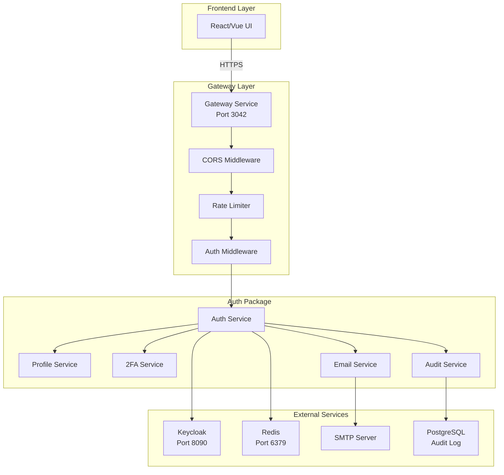
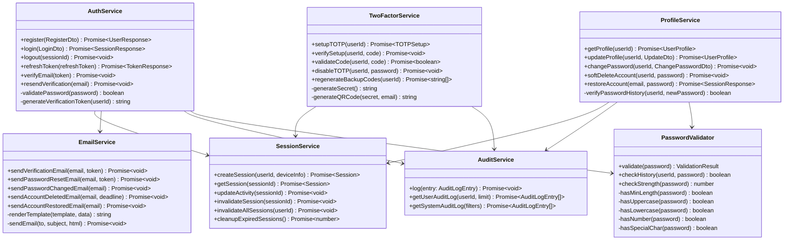
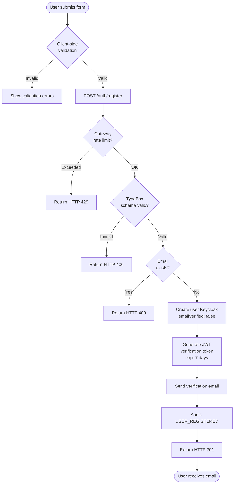
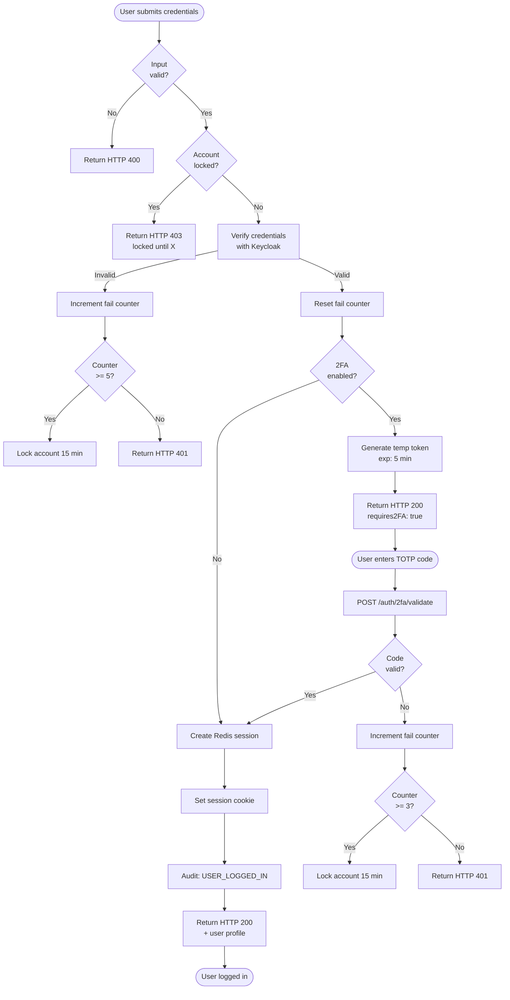
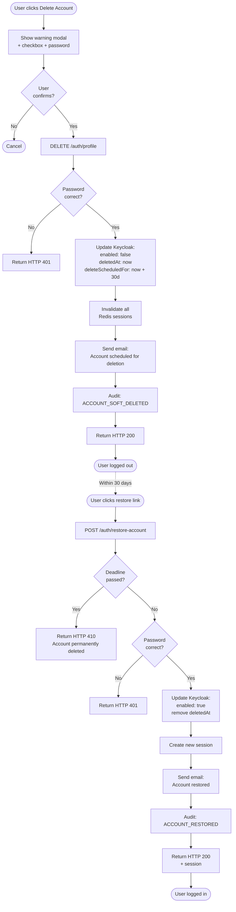

# User Lifecycle - Technical Design & Pseudocode

**Project**: Tech Citizen Software Gateway  
**Date**: 2025-12-11  
**Status**: Draft  
**Purpose**: Design tecnico e pseudo-codice per implementazione User Lifecycle Management

---

## 1. Architecture Overview

### 1.1 Component Diagram



### 1.2 Class Diagram - Auth Package



---

## 2. Data Flow Diagrams

### 2.1 Registration Flow



### 2.2 Login with 2FA Flow



### 2.3 Soft Delete + Restore Flow



---

## 3. Pseudocode Implementation

### 3.1 AuthService - Register

```typescript
/**
 * UC-001: User Registration
 * POST /auth/register
 */
async function register(dto: RegisterDto): Promise<UserResponse> {
  // Step 1: Validate input schema
  const validationResult = validateSchema(RegisterSchema, dto);
  if (!validationResult.valid) {
    throw new ValidationError(validationResult.errors);
  }

  // Step 2: Validate password strength
  const passwordValid = PasswordValidator.validate(dto.password);
  if (!passwordValid.isStrong) {
    throw new WeakPasswordError(passwordValid.suggestions);
  }

  // Step 3: Check rate limiting (5 registrations/hour per IP)
  const rateLimitKey = `register:${request.ip}`;
  const attempts = await redis.incr(rateLimitKey);
  if (attempts === 1) {
    await redis.expire(rateLimitKey, 3600); // 1 hour
  }
  if (attempts > 5) {
    throw new RateLimitError('Too many registration attempts');
  }

  // Step 4: Check if email already exists (Keycloak)
  const existingUser = await keycloak.getUserByEmail(dto.email);
  if (existingUser) {
    throw new ConflictError('Email already registered');
  }

  // Step 5: Create user in Keycloak
  const user = await keycloak.createUser({
    username: dto.email,
    email: dto.email,
    emailVerified: false,
    enabled: true, // Enabled but email not verified
    firstName: dto.firstName,
    lastName: dto.lastName,
    credentials: [
      {
        type: 'password',
        value: dto.password,
        temporary: false,
      },
    ],
    attributes: {
      passwordChangedAt: new Date().toISOString(),
    },
  });

  // Step 6: Generate email verification token
  const verificationToken = generateJWT(
    {
      userId: user.id,
      email: user.email,
      type: 'email_verification',
    },
    {
      expiresIn: '7d',
      issuer: 'auth-service',
    },
  );

  // Step 7: Send verification email
  await emailService.sendVerificationEmail(
    user.email,
    verificationToken,
    `${FRONTEND_URL}/verify-email?token=${verificationToken}`,
  );

  // Step 8: Audit log
  await auditService.log({
    userId: user.id,
    email: user.email,
    eventType: AuditEventType.USER_REGISTERED,
    action: 'REGISTER',
    resource: '/auth/register',
    method: 'POST',
    ipAddress: request.ip,
    userAgent: request.headers['user-agent'],
    success: true,
    statusCode: 201,
    timestamp: new Date().toISOString(),
  });

  // Step 9: Return success response (no sensitive data)
  return {
    id: user.id,
    email: user.email,
    emailVerified: false,
    message:
      'Registration successful. Please check your email to verify your account.',
  };
}
```

### 3.2 AuthService - Verify Email

```typescript
/**
 * UC-002: Email Verification
 * POST /auth/verify-email
 */
async function verifyEmail(token: string): Promise<void> {
  // Step 1: Validate JWT token
  let payload;
  try {
    payload = verifyJWT(token, {
      issuer: 'auth-service',
    });
  } catch (error) {
    if (error.name === 'TokenExpiredError') {
      throw new TokenExpiredError(
        'Verification token expired. Please request a new one.',
      );
    }
    throw new InvalidTokenError('Invalid verification token');
  }

  // Step 2: Check token type
  if (payload.type !== 'email_verification') {
    throw new InvalidTokenError('Invalid token type');
  }

  // Step 3: Get user from Keycloak
  const user = await keycloak.getUserById(payload.userId);
  if (!user) {
    throw new NotFoundError('User not found');
  }

  // Step 4: Check if already verified (idempotent)
  if (user.emailVerified) {
    // Already verified, return success silently
    return;
  }

  // Step 5: Update Keycloak - mark email verified
  await keycloak.updateUser(user.id, {
    emailVerified: true,
  });

  // Step 6: Audit log
  await auditService.log({
    userId: user.id,
    email: user.email,
    eventType: AuditEventType.EMAIL_VERIFIED,
    action: 'VERIFY_EMAIL',
    resource: '/auth/verify-email',
    method: 'POST',
    success: true,
    statusCode: 200,
    timestamp: new Date().toISOString(),
  });

  // Step 7: Send welcome email (optional)
  await emailService.sendWelcomeEmail(user.email, user.firstName);
}
```

### 3.3 AuthService - Login

```typescript
/**
 * UC-003: User Login
 * POST /auth/login
 */
async function login(
  dto: LoginDto,
  deviceInfo: DeviceInfo,
): Promise<SessionResponse> {
  // Step 1: Check account lockout
  const lockKey = `account_lock:${dto.username}`;
  const isLocked = await redis.get(lockKey);
  if (isLocked) {
    const ttl = await redis.ttl(lockKey);
    throw new ForbiddenError(
      `Account locked. Try again in ${Math.ceil(ttl / 60)} minutes.`,
    );
  }

  // Step 2: Verify credentials with Keycloak (OAuth2 password grant)
  let tokens;
  try {
    tokens = await keycloak.getTokenByPasswordGrant({
      username: dto.username,
      password: dto.password,
      clientId: KEYCLOAK_CLIENT_ID,
      clientSecret: KEYCLOAK_CLIENT_SECRET,
    });
  } catch (error) {
    // Invalid credentials - increment fail counter
    const failKey = `login_fail:${dto.username}`;
    const failCount = await redis.incr(failKey);

    if (failCount === 1) {
      await redis.expire(failKey, 900); // 15 min window
    }

    if (failCount >= 5) {
      // Lock account for 15 min
      await redis.setex(lockKey, 900, 'locked');
      await redis.del(failKey);

      await auditService.log({
        email: dto.username,
        eventType: AuditEventType.ACCOUNT_LOCKED,
        action: 'LOGIN_FAILED',
        resource: '/auth/login',
        method: 'POST',
        ipAddress: deviceInfo.ipAddress,
        success: false,
        statusCode: 403,
        errorMessage: 'Account locked due to too many failed attempts',
        timestamp: new Date().toISOString(),
      });

      throw new ForbiddenError(
        'Account locked due to too many failed attempts',
      );
    }

    await auditService.log({
      email: dto.username,
      eventType: AuditEventType.LOGIN_FAILED,
      action: 'LOGIN',
      resource: '/auth/login',
      method: 'POST',
      ipAddress: deviceInfo.ipAddress,
      success: false,
      statusCode: 401,
      errorMessage: 'Invalid credentials',
      timestamp: new Date().toISOString(),
    });

    throw new UnauthorizedError('Invalid credentials');
  }

  // Step 3: Get user info from access token
  const userInfo = decodeJWT(tokens.access_token);
  const user = await keycloak.getUserById(userInfo.sub);

  // Step 4: Check email verified
  if (!user.emailVerified) {
    throw new ForbiddenError('Please verify your email before logging in');
  }

  // Step 5: Reset fail counter on success
  await redis.del(`login_fail:${dto.username}`);

  // Step 6: Check if 2FA enabled
  const totpEnabled = user.attributes?.totpEnabled === 'true';
  if (totpEnabled) {
    // Generate temporary token for 2FA step
    const tempToken = generateJWT(
      {
        userId: user.id,
        email: user.email,
        type: 'temp_2fa',
      },
      {
        expiresIn: '5m', // 5 minutes to complete 2FA
        issuer: 'auth-service',
      },
    );

    return {
      requires2FA: true,
      tempToken,
      message: 'Please enter your 2FA code',
    };
  }

  // Step 7: Create session in Redis
  const session = await sessionService.createSession(user.id, {
    email: user.email,
    roles: user.realmRoles || [],
    permissions: await getPermissions(user.realmRoles),
    accessToken: tokens.access_token,
    refreshToken: tokens.refresh_token,
    deviceId: deviceInfo.deviceId,
    userAgent: deviceInfo.userAgent,
    ipAddress: deviceInfo.ipAddress,
    createdAt: new Date().toISOString(),
    lastActivityAt: new Date().toISOString(),
    expiresAt: new Date(Date.now() + 30 * 60 * 1000).toISOString(), // 30 min
  });

  // Step 8: Check concurrent sessions (max 3)
  const activeSessions = await sessionService.getUserSessions(user.id);
  if (activeSessions.length > 3) {
    // Remove oldest session
    const oldestSession = activeSessions.sort(
      (a, b) =>
        new Date(a.createdAt).getTime() - new Date(b.createdAt).getTime(),
    )[0];
    await sessionService.invalidateSession(oldestSession.sessionId);
  }

  // Step 9: Audit log
  await auditService.log({
    userId: user.id,
    email: user.email,
    eventType: AuditEventType.USER_LOGGED_IN,
    action: 'LOGIN',
    resource: '/auth/login',
    method: 'POST',
    sessionId: session.sessionId,
    ipAddress: deviceInfo.ipAddress,
    userAgent: deviceInfo.userAgent,
    success: true,
    statusCode: 200,
    timestamp: new Date().toISOString(),
  });

  // Step 10: Return session response
  return {
    sessionId: session.sessionId,
    user: {
      id: user.id,
      email: user.email,
      firstName: user.firstName,
      lastName: user.lastName,
      roles: user.realmRoles || [],
      permissions: session.permissions,
    },
    expiresAt: session.expiresAt,
  };
}
```

### 3.4 ProfileService - Soft Delete

```typescript
/**
 * UC-012: Soft Delete Account
 * DELETE /auth/profile
 */
async function softDeleteAccount(
  userId: string,
  password: string,
  confirmation: string,
): Promise<void> {
  // Step 1: Validate confirmation text
  if (confirmation !== 'DELETE') {
    throw new ValidationError('Confirmation text must be exactly "DELETE"');
  }

  // Step 2: Get user from Keycloak
  const user = await keycloak.getUserById(userId);
  if (!user) {
    throw new NotFoundError('User not found');
  }

  // Step 3: Verify password
  const passwordValid = await keycloak.verifyPassword(userId, password);
  if (!passwordValid) {
    throw new UnauthorizedError('Incorrect password');
  }

  // Step 4: Calculate deletion deadline (30 days)
  const now = new Date();
  const deleteScheduledFor = new Date(now.getTime() + 30 * 24 * 60 * 60 * 1000);

  // Step 5: Update Keycloak - soft delete
  await keycloak.updateUser(userId, {
    enabled: false, // Disable login
    attributes: {
      ...user.attributes,
      deletedAt: now.toISOString(),
      deleteScheduledFor: deleteScheduledFor.toISOString(),
    },
  });

  // Step 6: Invalidate all sessions
  await sessionService.invalidateAllSessions(userId);

  // Step 7: Send confirmation email with restore link
  const restoreToken = generateJWT(
    {
      userId: user.id,
      email: user.email,
      type: 'account_restore',
    },
    {
      expiresIn: '30d',
      issuer: 'auth-service',
    },
  );

  await emailService.sendAccountDeletedEmail(
    user.email,
    deleteScheduledFor,
    `${FRONTEND_URL}/restore-account?token=${restoreToken}`,
  );

  // Step 8: Audit log
  await auditService.log({
    userId: user.id,
    email: user.email,
    eventType: AuditEventType.ACCOUNT_SOFT_DELETED,
    action: 'SOFT_DELETE',
    resource: '/auth/profile',
    method: 'DELETE',
    success: true,
    statusCode: 200,
    timestamp: now.toISOString(),
  });
}
```

### 3.5 TwoFactorService - Setup TOTP

```typescript
/**
 * UC-009: Enable 2FA
 * POST /auth/2fa/setup
 */
async function setupTOTP(userId: string): Promise<TOTPSetup> {
  // Step 1: Get user from Keycloak
  const user = await keycloak.getUserById(userId);
  if (!user) {
    throw new NotFoundError('User not found');
  }

  // Step 2: Check if 2FA already enabled
  if (user.attributes?.totpEnabled === 'true') {
    throw new ConflictError('2FA already enabled');
  }

  // Step 3: Generate TOTP secret (base32)
  const secret = speakeasy.generateSecret({
    name: `Gateway:${user.email}`,
    issuer: 'Tech Citizen Gateway',
    length: 32,
  });

  // Step 4: Generate QR code URL
  const qrCodeUrl = secret.otpauth_url;

  // Step 5: Generate backup codes (10 codes, 8 chars each)
  const backupCodes = Array.from(
    { length: 10 },
    () => generateRandomString(8, 'ABCDEFGHJKLMNPQRSTUVWXYZ23456789'), // No ambiguous chars
  );

  // Step 6: Store secret temporarily in Redis (pending verification)
  const tempKey = `totp_setup:${userId}`;
  await redis.setex(
    tempKey,
    600,
    JSON.stringify({
      // 10 min expiry
      secret: secret.base32,
      backupCodes,
    }),
  );

  // Step 7: Return setup data (secret shown only once)
  return {
    secret: secret.base32,
    qrCodeUrl,
    backupCodes,
    message: 'Scan QR code with authenticator app and enter code to verify',
  };
}

/**
 * UC-009: Verify 2FA Setup
 * POST /auth/2fa/verify
 */
async function verifySetup(userId: string, code: string): Promise<void> {
  // Step 1: Get temporary setup data from Redis
  const tempKey = `totp_setup:${userId}`;
  const setupData = await redis.get(tempKey);
  if (!setupData) {
    throw new NotFoundError('2FA setup expired or not initiated');
  }

  const { secret, backupCodes } = JSON.parse(setupData);

  // Step 2: Verify TOTP code
  const isValid = speakeasy.totp.verify({
    secret,
    encoding: 'base32',
    token: code,
    window: 1, // Allow 30s clock skew
  });

  if (!isValid) {
    throw new UnauthorizedError('Invalid 2FA code');
  }

  // Step 3: Hash backup codes for storage
  const hashedBackupCodes = await Promise.all(
    backupCodes.map(code => bcrypt.hash(code, 10)),
  );

  // Step 4: Update Keycloak - enable 2FA
  await keycloak.updateUser(userId, {
    attributes: {
      totpEnabled: 'true',
      totpSecret: await encrypt(secret), // Encrypt secret
      backupCodes: hashedBackupCodes,
    },
  });

  // Step 5: Delete temporary setup data
  await redis.del(tempKey);

  // Step 6: Audit log
  await auditService.log({
    userId,
    eventType: AuditEventType.TWO_FA_ENABLED,
    action: '2FA_SETUP',
    resource: '/auth/2fa/verify',
    method: 'POST',
    success: true,
    statusCode: 200,
    timestamp: new Date().toISOString(),
  });

  // Step 7: Send confirmation email
  const user = await keycloak.getUserById(userId);
  await emailService.send2FAEnabledEmail(user.email);
}
```

---

## 4. Database Schemas

### 4.1 PostgreSQL - Audit Log Table

```sql
CREATE TYPE audit_event_type AS ENUM (
  'USER_REGISTERED',
  'EMAIL_VERIFIED',
  'USER_LOGGED_IN',
  'USER_LOGGED_OUT',
  'LOGIN_FAILED',
  'ACCOUNT_LOCKED',
  'PROFILE_VIEWED',
  'PROFILE_UPDATED',
  'PASSWORD_CHANGED',
  'PASSWORD_RESET',
  'TWO_FA_ENABLED',
  'TWO_FA_DISABLED',
  'TWO_FA_BACKUP_USED',
  'ACCOUNT_SUSPENDED',
  'ACCOUNT_UNSUSPENDED',
  'ACCOUNT_SOFT_DELETED',
  'ACCOUNT_RESTORED',
  'ACCOUNT_HARD_DELETED'
);

CREATE TABLE audit_log (
  id UUID PRIMARY KEY DEFAULT gen_random_uuid(),
  user_id UUID NOT NULL,
  email VARCHAR(255) NOT NULL,

  -- Event details
  event_type audit_event_type NOT NULL,
  action VARCHAR(50) NOT NULL,
  resource VARCHAR(255) NOT NULL,
  method VARCHAR(10) NOT NULL,

  -- Request context
  ip_address INET,
  user_agent TEXT,
  session_id UUID,

  -- Changes (JSONB for flexibility)
  changes JSONB,

  -- Result
  success BOOLEAN NOT NULL,
  status_code INTEGER NOT NULL,
  error_message TEXT,

  -- Timestamp
  timestamp TIMESTAMP WITH TIME ZONE NOT NULL DEFAULT NOW(),

  -- Indexes
  INDEX idx_audit_user_id (user_id),
  INDEX idx_audit_email (email),
  INDEX idx_audit_event_type (event_type),
  INDEX idx_audit_timestamp (timestamp DESC),
  INDEX idx_audit_session_id (session_id)
);

-- Partition by month for performance (retention: 7 years)
CREATE TABLE audit_log_2025_12 PARTITION OF audit_log
  FOR VALUES FROM ('2025-12-01') TO ('2026-01-01');
```

### 4.2 Redis - Session Schema

```typescript
// Key pattern: session:{sessionId}
interface RedisSession {
  sessionId: string; // UUID
  userId: string; // Keycloak user ID
  email: string;
  roles: string[];
  permissions: string[];

  // Tokens (encrypted)
  accessToken: string;
  refreshToken: string;

  // Metadata
  createdAt: string; // ISO 8601
  lastActivityAt: string; // ISO 8601
  expiresAt: string; // ISO 8601

  // Device tracking
  deviceId: string;
  userAgent: string;
  ipAddress: string;

  // 2FA tracking
  twoFactorVerified: boolean;
  twoFactorAt?: string;
}

// TTL: 30 minutes (sliding window on activity)
// Key example: session:550e8400-e29b-41d4-a716-446655440000
```

### 4.3 Redis - Rate Limiting Schema

```typescript
// Key patterns:
// - register:{ip_address} → counter (TTL: 1 hour)
// - login_fail:{email} → counter (TTL: 15 min)
// - account_lock:{email} → flag (TTL: 15 min)
// - password_reset:{email} → counter (TTL: 1 hour)
// - 2fa_fail:{userId} → counter (TTL: 15 min)

// Example:
// Key: register:192.168.1.100
// Value: 3 (attempts)
// TTL: 2400 seconds (40 min remaining)
```

---

## 5. API Contract Specifications

### 5.1 POST /auth/register

**Request**:

```typescript
interface RegisterRequest {
  email: string; // Max 255 char, email format
  password: string; // Min 12 char, complexity required
  firstName: string; // Max 100 char
  lastName: string; // Max 100 char
  acceptedTerms: boolean; // Must be true
  acceptedPrivacy: boolean; // Must be true
}
```

**Response 201**:

```typescript
interface RegisterResponse {
  id: string; // UUID
  email: string;
  emailVerified: false;
  message: string;
}
```

**Errors**:

- `400` - Validation error (weak password, invalid email)
- `409` - Email already registered
- `429` - Rate limit exceeded (5 registrations/hour per IP)

### 5.2 POST /auth/login

**Request**:

```typescript
interface LoginRequest {
  username: string; // Email
  password: string;
  rememberMe?: boolean; // Default: false
}
```

**Response 200 (No 2FA)**:

```typescript
interface LoginResponse {
  user: {
    id: string;
    email: string;
    firstName: string;
    lastName: string;
    roles: string[];
    permissions: string[];
  };
  expiresAt: string; // ISO 8601
}
```

**Response 200 (2FA Required)**:

```typescript
interface LoginWith2FAResponse {
  requires2FA: true;
  tempToken: string; // JWT, exp: 5 min
  message: string;
}
```

**Errors**:

- `401` - Invalid credentials
- `403` - Email not verified | Account locked | Account suspended
- `429` - Rate limit exceeded

### 5.3 PATCH /auth/profile

**Request**:

```typescript
interface UpdateProfileRequest {
  firstName?: string;
  lastName?: string;
  attributes?: {
    phone?: string;
    department?: string;
    language?: 'it' | 'en';
  };
}
```

**Response 200**:

```typescript
interface ProfileResponse {
  id: string;
  email: string;
  emailVerified: boolean;
  firstName: string;
  lastName: string;
  attributes: Record<string, string>;
  roles: string[];
  createdAt: string;
  lastLogin: string;
}
```

**Errors**:

- `400` - Validation error
- `401` - Unauthorized (session expired)
- `409` - Concurrent update conflict (use ETag)

---

## 6. State Transition Tables

### 6.1 User Account States

| Current State          | Event                 | Next State             | Conditions        | Side Effects                        |
| ---------------------- | --------------------- | ---------------------- | ----------------- | ----------------------------------- |
| `NONE`                 | Register              | `PENDING_VERIFICATION` | Valid input       | Send verification email             |
| `PENDING_VERIFICATION` | Verify email          | `VERIFIED`             | Token valid       | Enable login                        |
| `PENDING_VERIFICATION` | Token expired (7d)    | `EXPIRED`              | Timeout           | Require re-registration             |
| `VERIFIED`             | Login                 | `ACTIVE`               | Credentials valid | Create session                      |
| `ACTIVE`               | Logout                | `LOCKED`               | -                 | Invalidate session                  |
| `ACTIVE`               | Admin suspend         | `SUSPENDED`            | Admin action      | Invalidate all sessions             |
| `ACTIVE`               | User soft delete      | `SOFT_DELETED`         | Password verified | Disable login, schedule hard delete |
| `SUSPENDED`            | Admin unsuspend       | `ACTIVE`               | Admin action      | Send email notification             |
| `SOFT_DELETED`         | User restore          | `ACTIVE`               | Within 30 days    | Re-enable login                     |
| `SOFT_DELETED`         | Deadline passed (30d) | `DELETED`              | Cron job          | Permanent deletion (GDPR)           |

### 6.2 Session States

| Current State | Event              | Next State   | Conditions         | TTL         |
| ------------- | ------------------ | ------------ | ------------------ | ----------- |
| `NONE`        | Login success      | `ACTIVE`     | Credentials valid  | 30 min      |
| `ACTIVE`      | User activity      | `ACTIVE`     | Activity detected  | Refresh TTL |
| `ACTIVE`      | Inactivity timeout | `EXPIRED`    | No activity 30 min | 0           |
| `ACTIVE`      | Explicit logout    | `TERMINATED` | User action        | 0           |
| `ACTIVE`      | Password changed   | `TERMINATED` | Security event     | 0           |
| `ACTIVE`      | Account deleted    | `TERMINATED` | User action        | 0           |

### 6.3 2FA States

| Current State          | Event                  | Next State             | Conditions            | Notes                     |
| ---------------------- | ---------------------- | ---------------------- | --------------------- | ------------------------- |
| `DISABLED`             | User setup 2FA         | `PENDING_VERIFICATION` | TOTP secret generated | QR code shown             |
| `PENDING_VERIFICATION` | User verifies code     | `ENABLED`              | Code valid            | Backup codes issued       |
| `PENDING_VERIFICATION` | Setup timeout (10 min) | `DISABLED`             | Expired               | Must restart setup        |
| `ENABLED`              | Login with 2FA         | `ENABLED`              | Code valid            | Session created           |
| `ENABLED`              | Use backup code        | `ENABLED`              | Code valid, not used  | Consume code              |
| `ENABLED`              | User disables 2FA      | `DISABLED`             | Password verified     | Invalidate secret + codes |

---

## 7. Error Code Catalog

### 7.1 Authentication Errors (AUTH\_\*)

| Code                       | HTTP | Message                             | Resolution                             |
| -------------------------- | ---- | ----------------------------------- | -------------------------------------- |
| `AUTH_INVALID_CREDENTIALS` | 401  | Invalid email or password           | Check credentials                      |
| `AUTH_EMAIL_NOT_VERIFIED`  | 403  | Please verify your email first      | Check inbox, resend verification       |
| `AUTH_ACCOUNT_LOCKED`      | 403  | Account locked for 15 minutes       | Wait or contact support                |
| `AUTH_ACCOUNT_SUSPENDED`   | 403  | Account suspended by administrator  | Contact support                        |
| `AUTH_ACCOUNT_DELETED`     | 410  | Account has been deleted            | Re-register or restore (if within 30d) |
| `AUTH_2FA_REQUIRED`        | 200  | 2FA code required                   | Enter TOTP code                        |
| `AUTH_2FA_INVALID_CODE`    | 401  | Invalid 2FA code                    | Try again or use backup code           |
| `AUTH_SESSION_EXPIRED`     | 401  | Session expired, please login again | Re-login                               |
| `AUTH_TOKEN_INVALID`       | 401  | Invalid or malformed token          | Request new token                      |
| `AUTH_TOKEN_EXPIRED`       | 401  | Token has expired                   | Request new token (verification/reset) |

### 7.2 Validation Errors (VAL\_\*)

| Code                        | HTTP | Message                             | Resolution                |
| --------------------------- | ---- | ----------------------------------- | ------------------------- |
| `VAL_WEAK_PASSWORD`         | 400  | Password does not meet requirements | Min 12 char, complexity   |
| `VAL_PASSWORD_IN_HISTORY`   | 400  | Password recently used              | Choose different password |
| `VAL_INVALID_EMAIL`         | 400  | Invalid email format                | Check email address       |
| `VAL_REQUIRED_FIELD`        | 400  | Field {field} is required           | Provide missing field     |
| `VAL_FIELD_TOO_LONG`        | 400  | Field {field} exceeds max length    | Reduce length             |
| `VAL_CONFIRMATION_MISMATCH` | 400  | Confirmation does not match         | Type "DELETE" exactly     |

### 7.3 Rate Limit Errors (RATE\_\*)

| Code                        | HTTP | Message                        | Resolution      |
| --------------------------- | ---- | ------------------------------ | --------------- |
| `RATE_LIMIT_REGISTRATION`   | 429  | Too many registration attempts | Wait 1 hour     |
| `RATE_LIMIT_LOGIN`          | 429  | Too many login attempts        | Wait 15 minutes |
| `RATE_LIMIT_PASSWORD_RESET` | 429  | Too many reset requests        | Wait 1 hour     |

### 7.4 Resource Errors (RES\_\*)

| Code                      | HTTP | Message                         | Resolution                   |
| ------------------------- | ---- | ------------------------------- | ---------------------------- |
| `RES_EMAIL_EXISTS`        | 409  | Email already registered        | Use different email or login |
| `RES_USER_NOT_FOUND`      | 404  | User not found                  | Check user ID (admin only)   |
| `RES_CONCURRENT_UPDATE`   | 409  | Profile modified, please reload | Refresh and retry            |
| `RES_2FA_ALREADY_ENABLED` | 409  | 2FA already enabled             | Disable first to re-setup    |

---

## 8. Performance Requirements

### 8.1 Response Time SLOs

| Endpoint              | P50     | P95     | P99     | Max |
| --------------------- | ------- | ------- | ------- | --- |
| `POST /auth/register` | < 200ms | < 500ms | < 1s    | 3s  |
| `POST /auth/login`    | < 150ms | < 400ms | < 800ms | 2s  |
| `GET /auth/profile`   | < 50ms  | < 150ms | < 300ms | 1s  |
| `PATCH /auth/profile` | < 100ms | < 300ms | < 600ms | 2s  |
| `POST /auth/2fa/*`    | < 100ms | < 250ms | < 500ms | 1s  |

### 8.2 Throughput Requirements

| Metric                  | Target    | Notes                      |
| ----------------------- | --------- | -------------------------- |
| **Concurrent Sessions** | 1000+     | Per gateway instance       |
| **Login TPS**           | 50 req/s  | Peak load                  |
| **Profile Read TPS**    | 200 req/s | Cache-friendly             |
| **Session Lookup**      | < 10ms    | Redis performance critical |

### 8.3 Scalability Targets

| Component      | Scaling Strategy        | Target                 |
| -------------- | ----------------------- | ---------------------- |
| **Gateway**    | Horizontal (stateless)  | 3+ instances           |
| **Keycloak**   | Clustered (HA)          | 2+ instances           |
| **Redis**      | Sentinel (HA) / Cluster | 3+ nodes               |
| **PostgreSQL** | Read replicas           | 1 primary + 2 replicas |

---

## 9. Security Checklist

### 9.1 OWASP Top 10 Mitigations

| Threat                             | Mitigation                                 | Implementation Status                    |
| ---------------------------------- | ------------------------------------------ | ---------------------------------------- |
| **A01: Broken Access Control**     | RBAC, session validation                   | ⚠️ Partial (JWT validation OK, RBAC TBD) |
| **A02: Cryptographic Failures**    | TLS 1.3, bcrypt passwords                  | ✅ OK (Keycloak handles)                 |
| **A03: Injection**                 | Prepared statements, input validation      | ✅ OK (TypeBox + ORM)                    |
| **A04: Insecure Design**           | Threat modeling, security by design        | ⚠️ This document addresses               |
| **A05: Security Misconfiguration** | Hardened Keycloak, secure defaults         | ⚠️ Keycloak defaults need review         |
| **A06: Vulnerable Components**     | Dependabot, npm audit                      | ✅ OK (automated checks)                 |
| **A07: Auth Failures**             | MFA, rate limiting, lockout                | ⚠️ Partial (2FA TBD, lockout OK)         |
| **A08: Data Integrity Failures**   | HMAC, digital signatures                   | ✅ OK (JWT signatures)                   |
| **A09: Logging Failures**          | Comprehensive audit log                    | ⚠️ Partial (need SIEM integration)       |
| **A10: SSRF**                      | Whitelist origins, no user-controlled URLs | ✅ OK (no SSRF vectors)                  |

### 9.2 GDPR Compliance Checklist

| Requirement                     | Implementation                     | Status                    |
| ------------------------------- | ---------------------------------- | ------------------------- |
| **Lawfulness**                  | Explicit consent (terms checkbox)  | ❌ TBD                    |
| **Purpose Limitation**          | Data only for auth/profile         | ✅ OK                     |
| **Data Minimization**           | Collect only necessary fields      | ✅ OK                     |
| **Accuracy**                    | User can update profile            | ⚠️ Partial (API TBD)      |
| **Storage Limitation**          | 30-day soft delete + hard delete   | ⚠️ Partial (cron job TBD) |
| **Integrity & Confidentiality** | TLS, encrypted secrets, bcrypt     | ✅ OK                     |
| **Accountability**              | Audit log 7-year retention         | ⚠️ Partial (schema ready) |
| **Right to Access**             | GET /auth/profile + audit log      | ❌ TBD                    |
| **Right to Rectification**      | PATCH /auth/profile                | ❌ TBD                    |
| **Right to Erasure**            | DELETE /auth/profile (hard delete) | ❌ TBD                    |
| **Right to Portability**        | Export user data JSON              | ❌ TBD                    |
| **Right to Object**             | Opt-out marketing emails           | ❌ TBD                    |

---

## 10. Testing Strategy

### 10.1 Unit Test Coverage Matrix

| Component           | Test Type     | Coverage Target | Priority |
| ------------------- | ------------- | --------------- | -------- |
| `AuthService`       | Unit          | 90%             | P0       |
| `ProfileService`    | Unit          | 90%             | P0       |
| `TwoFactorService`  | Unit          | 85%             | P1       |
| `SessionService`    | Unit          | 90%             | P0       |
| `EmailService`      | Unit (mocked) | 80%             | P1       |
| `AuditService`      | Unit          | 85%             | P1       |
| `PasswordValidator` | Unit          | 100%            | P0       |

### 10.2 Integration Test Scenarios

| Scenario                      | Components                     | Data Setup            | Assertions                             |
| ----------------------------- | ------------------------------ | --------------------- | -------------------------------------- |
| **Register → Verify → Login** | Auth + Keycloak + Email        | Clean DB              | User can login after verification      |
| **Login with 2FA**            | Auth + Keycloak + Redis + TOTP | User with 2FA enabled | Session created after code validation  |
| **Soft Delete → Restore**     | Profile + Keycloak + Redis     | Active user           | User restored with valid password      |
| **Password Reset Flow**       | Auth + Keycloak + Email        | Existing user         | Password changed, old password invalid |
| **Concurrent Profile Update** | Profile + Keycloak             | Same user, 2 requests | HTTP 409 on conflict                   |

### 10.3 E2E Test Scenarios (BDD)

See next section for full Gherkin scenarios.

---

## 11. Monitoring & Observability

### 11.1 Key Metrics

```typescript
// Prometheus metrics to expose

// Authentication metrics
counter('auth_register_total', { status: 'success' | 'failure' });
counter('auth_login_total', {
  status: 'success' | 'failure',
  method: 'password' | '2fa',
});
counter('auth_logout_total');
counter('auth_password_reset_total');

// Session metrics
gauge('auth_active_sessions', { user_id });
histogram('auth_session_duration_seconds');

// 2FA metrics
counter('auth_2fa_setup_total', { status: 'success' | 'failure' });
counter('auth_2fa_validation_total', {
  status: 'success' | 'failure',
  method: 'totp' | 'backup',
});

// Error metrics
counter('auth_errors_total', { code: string, endpoint: string });

// Performance metrics
histogram('auth_endpoint_duration_ms', { endpoint: string, method: string });
```

### 11.2 Health Checks

```typescript
interface HealthCheckResponse {
  status: 'healthy' | 'degraded' | 'unhealthy';
  checks: {
    keycloak: 'up' | 'down';
    redis: 'up' | 'down';
    postgres: 'up' | 'down';
    smtp: 'up' | 'down';
  };
  timestamp: string;
}
```

### 11.3 Alerting Rules

| Alert                       | Condition                 | Severity | Action              |
| --------------------------- | ------------------------- | -------- | ------------------- |
| **High Login Failure Rate** | > 20% failures in 5 min   | Warning  | Check for attack    |
| **Session Store Down**      | Redis unavailable > 1 min | Critical | Page on-call        |
| **Keycloak Unavailable**    | No response > 30s         | Critical | Page on-call        |
| **Slow Login**              | P95 > 2s for 5 min        | Warning  | Check performance   |
| **Audit Log Backlog**       | Queue size > 1000         | Warning  | Scale audit service |

---

**Document Status**: Draft - Technical Design  
**Next Step**: Define User Stories + BDD Acceptance Criteria  
**Estimated Reading Time**: 45 minutes
