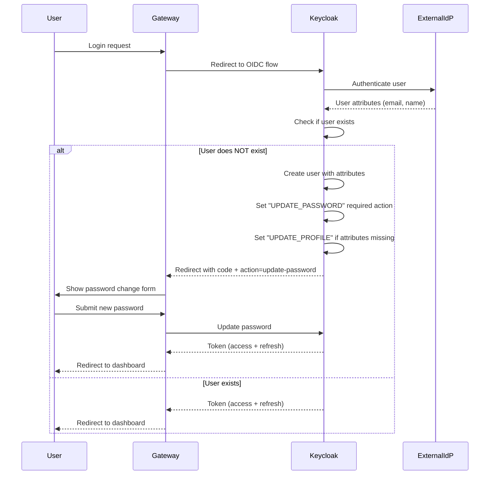

# ADR-003: User Management Architecture (System vs Domain Users)

**Status**: Proposed  
**Date**: 2025-12-09  
**Decision Makers**: Antonio Cittadino  
**Epic**: EPIC-009 - Reusable Auth Package  
**User Stories**: US-039 (Keycloak Integration), US-040 (Session Management)

---

## Context

L'applicazione healthcare necessita di gestire due tipologie di utenti con caratteristiche diverse:

1. **System Users** - Utenti tecnici creati manualmente (admin, service accounts, test users)
2. **Domain Users** - Utenti di dominio che accedono tramite SSO/OIDC (medici, infermieri, pazienti)

### Requisiti Funzionali

- Gli utenti di sistema devono essere creati manualmente da un amministratore
- Gli utenti di dominio devono essere auto-creati al primo login SSO
- Al primo accesso, gli utenti devono cambiare la password temporanea
- Le sessioni devono essere gestite in modo sicuro (Redis-backed)
- Keycloak deve essere l'unico Identity Provider (IdP)

### Problemi da Risolvere

1. Come distinguere utenti di sistema da utenti di dominio?
2. Quale strategia di password per il primo accesso?
3. Come gestire la sincronizzazione user attributes tra IdP e applicazione?
4. Come implementare la creazione automatica al primo login SSO?

---

## Decision

Implementare una **dual-user architecture** con Keycloak come IdP centralizzato:

### 1. User Type Classification

**System Users**:

- Creati manualmente via Keycloak Admin Console o API
- Realm: `healthcare-system`
- Attribute: `user_type=system`
- Password: Gestita localmente in Keycloak
- Use case: Amministratori, service accounts, utenti di test

**Domain Users**:

- Auto-creati tramite OIDC flow al primo login
- Realm: `healthcare-domain`
- Attribute: `user_type=domain`
- Password: Gestita da IdP esterno (Active Directory, LDAP, Google Workspace)
- Use case: Medici, infermieri, pazienti, operatori sanitari

### 2. First Login Flow (Domain Users)



### 3. Keycloak Configuration

**Realm Settings** (`healthcare-domain`):

```json
{
  "realm": "healthcare-domain",
  "enabled": true,
  "registrationAllowed": false,
  "resetPasswordAllowed": true,
  "rememberMe": true,
  "verifyEmail": true,
  "loginWithEmailAllowed": true,
  "duplicateEmailsAllowed": false,
  "sslRequired": "external",
  "defaultSignatureAlgorithm": "RS256"
}
```

**Identity Provider (OIDC)**:

```json
{
  "alias": "corporate-sso",
  "providerId": "oidc",
  "enabled": true,
  "trustEmail": true,
  "storeToken": false,
  "addReadTokenRoleOnCreate": false,
  "authenticateByDefault": false,
  "linkOnly": false,
  "firstBrokerLoginFlowAlias": "first-broker-login-with-password-update",
  "config": {
    "clientId": "${OIDC_CLIENT_ID}",
    "clientSecret": "${OIDC_CLIENT_SECRET}",
    "authorizationUrl": "https://idp.company.com/authorize",
    "tokenUrl": "https://idp.company.com/token",
    "userInfoUrl": "https://idp.company.com/userinfo",
    "defaultScope": "openid email profile",
    "syncMode": "IMPORT"
  }
}
```

**User Attributes Mapping**:

```json
{
  "mappers": [
    {
      "name": "email",
      "identityProviderMapper": "oidc-user-attribute-idp-mapper",
      "config": {
        "claim": "email",
        "user.attribute": "email"
      }
    },
    {
      "name": "first-name",
      "config": {
        "claim": "given_name",
        "user.attribute": "firstName"
      }
    },
    {
      "name": "last-name",
      "config": {
        "claim": "family_name",
        "user.attribute": "lastName"
      }
    },
    {
      "name": "user-type",
      "config": {
        "claim": "",
        "user.attribute": "user_type",
        "attribute.value": "domain"
      }
    }
  ]
}
```

### 4. Authentication Flow (First Broker Login)

**Custom Flow**: `first-broker-login-with-password-update`

```text
1. Create User If Unique (Execution: REQUIRED)
   - Check if user with email exists
   - If not, create user with attributes from IdP

2. Automatically Set Existing User (Execution: ALTERNATIVE)
   - If user exists, link IdP to existing account

3. Review Profile (Execution: REQUIRED)
   - Force user to review/complete profile attributes
   - Skip if all required attributes provided by IdP

4. Update Password (Execution: REQUIRED)
   - Force user to set local password (temporary)
   - Password complexity: min 12 chars, uppercase, lowercase, number, special
   - Password expires after 90 days (configurable)
```

### 5. Session Management

**Redis-backed Sessions**:

```typescript
// packages/auth/src/session.ts
import Redis from 'ioredis';
import { FastifyRequest, FastifyReply } from 'fastify';

interface SessionData {
  userId: string;
  userType: 'system' | 'domain';
  email: string;
  roles: string[];
  attributes: Record<string, unknown>;
  createdAt: string;
  expiresAt: string;
}

class SessionManager {
  private redis: Redis;
  private readonly SESSION_TTL = 3600; // 1 hour
  private readonly REFRESH_THRESHOLD = 300; // 5 minutes

  async createSession(userId: string, tokenPayload: unknown): Promise<string> {
    const sessionId = crypto.randomUUID();
    const sessionData: SessionData = {
      userId,
      userType: tokenPayload.user_type || 'domain',
      email: tokenPayload.email,
      roles: tokenPayload.realm_access?.roles || [],
      attributes: tokenPayload.attributes || {},
      createdAt: new Date().toISOString(),
      expiresAt: new Date(Date.now() + this.SESSION_TTL * 1000).toISOString(),
    };

    await this.redis.setex(
      `session:${sessionId}`,
      this.SESSION_TTL,
      JSON.stringify(sessionData),
    );

    return sessionId;
  }

  async refreshSession(sessionId: string): Promise<boolean> {
    const ttl = await this.redis.ttl(`session:${sessionId}`);

    if (ttl < this.REFRESH_THRESHOLD) {
      await this.redis.expire(`session:${sessionId}`, this.SESSION_TTL);
      return true;
    }

    return false;
  }

  async destroySession(sessionId: string): Promise<void> {
    await this.redis.del(`session:${sessionId}`);
  }
}
```

### 6. Password Policy

**System Users**:

- Minimum 12 characters
- At least 1 uppercase, 1 lowercase, 1 digit, 1 special char
- Password expires every 90 days
- Cannot reuse last 5 passwords
- Max 5 failed attempts → account locked for 15 minutes

**Domain Users** (temporary password):

- Minimum 16 characters
- At least 1 uppercase, 1 lowercase, 1 digit, 1 special char
- Expires after first use OR 24 hours
- Cannot match common passwords (dictionary check)

---

## Consequences

### Positive

✅ **Separation of Concerns**: System users e domain users gestiti separatamente  
✅ **Security**: Temporary password al primo login previene accessi non autorizzati  
✅ **Scalability**: Redis sessions permettono horizontal scaling del gateway  
✅ **SSO Integration**: Facile integrazione con IdP esterni (AD, Google, Azure AD)  
✅ **Audit Trail**: Keycloak traccia tutti gli eventi di autenticazione  
✅ **Centralized IdP**: Single source of truth per identità e permessi

### Negative

❌ **Complexity**: Richiede configurazione Keycloak custom (flows, mappers)  
❌ **Redis Dependency**: Sessioni dipendono da Redis (single point of failure)  
❌ **Password Management**: Domain users devono gestire due password (IdP + local)  
❌ **First Login UX**: Flow multi-step può confondere gli utenti  
❌ **Sync Issues**: Attributes mapping può fallire se IdP non fornisce claim richiesti

### Mitigations

- **Redis HA**: Configurare Redis Sentinel o Cluster per high availability
- **Password Sync**: Considerare passwordless auth (WebAuthn) per domain users
- **UX Improvement**: Progressive disclosure nel form di primo accesso
- **Fallback Mechanism**: Se mapping fallisce, richiedere attributes manualmente

---

## Alternatives Considered

### Alternative 1: Single Realm for All Users

**Pros**:

- Configurazione più semplice
- Meno complexity in Keycloak

**Cons**:

- ❌ Difficile distinguere system vs domain users
- ❌ Policy di password unica per tutti
- ❌ Rischio di mixing concerns (admin vs operatori)

**Rejected**: Non permette policy differenziate

---

### Alternative 2: Passwordless for Domain Users

**Description**: Usare WebAuthn/FIDO2 invece di password temporanea

**Pros**:

- ✅ Migliore UX (no password da ricordare)
- ✅ Maggiore security (phishing-resistant)
- ✅ Nessun sync password

**Cons**:

- ❌ Richiede hardware token o biometrics
- ❌ Complessità tecnica elevata
- ❌ Not all devices supportano WebAuthn

**Decision**: Considerare per v2.0, iniziare con password temporanea per MVP

---

### Alternative 3: Just-In-Time (JIT) Provisioning Senza Password Locale

**Description**: Domain users non hanno password locale, solo SSO

**Pros**:

- ✅ Nessun sync password
- ✅ True SSO experience

**Cons**:

- ❌ Se IdP esterno è down, domain users non possono accedere
- ❌ Nessun fallback mechanism
- ❌ Difficile testing senza IdP esterno

**Decision**: Rejected per healthcare (need offline access in emergencies)

---

## Implementation Plan

### Phase 1: Keycloak Setup (US-039 - 4h)

**Tasks**:

- [ ] Create realm `healthcare-domain`
- [ ] Create realm `healthcare-system`
- [ ] Configure OIDC Identity Provider
- [ ] Setup attribute mappers
- [ ] Create custom authentication flow `first-broker-login-with-password-update`
- [ ] Configure password policies
- [ ] Test flow manually

**Acceptance Criteria**:

```gherkin
Given an external IdP is configured
When a new user logs in via SSO for the first time
Then the user is created in Keycloak
And the user is prompted to set a temporary password
And the user can access the application after password change
```

### Phase 2: Session Management (US-040 - 3h)

**Tasks**:

- [ ] Install ioredis + @fastify/session
- [ ] Implement SessionManager class
- [ ] Add session refresh logic (sliding window)
- [ ] Add session destroy on logout
- [ ] Test session persistence across restarts

**Acceptance Criteria**:

```gherkin
Given a user is logged in
When the session expires
Then the user is redirected to login
And the session is removed from Redis
```

### Phase 3: Integration with Gateway (2h)

**Tasks**:

- [ ] Add Keycloak integration to gateway
- [ ] Implement OIDC callback handler
- [ ] Add session validation middleware
- [ ] Add logout endpoint
- [ ] Test end-to-end flow

---

## References

- [Keycloak First Broker Login](https://www.keycloak.org/docs/latest/server_admin/#_identity_broker_first_login)
- [OIDC Specification](https://openid.net/specs/openid-connect-core-1_0.html)
- [Redis Session Store](https://github.com/fastify/session#using-a-custom-session-store)
- [WebAuthn (future)](https://webauthn.io/)

---

## Revision History

| Date       | Version | Changes                                   | Author            |
| ---------- | ------- | ----------------------------------------- | ----------------- |
| 2025-12-09 | 1.0     | Initial proposal (dual-realm architecture | Antonio Cittadino |

---

_This ADR is part of EPIC-009 (Reusable Auth Package) and blocks US-039 (Keycloak Integration)._
