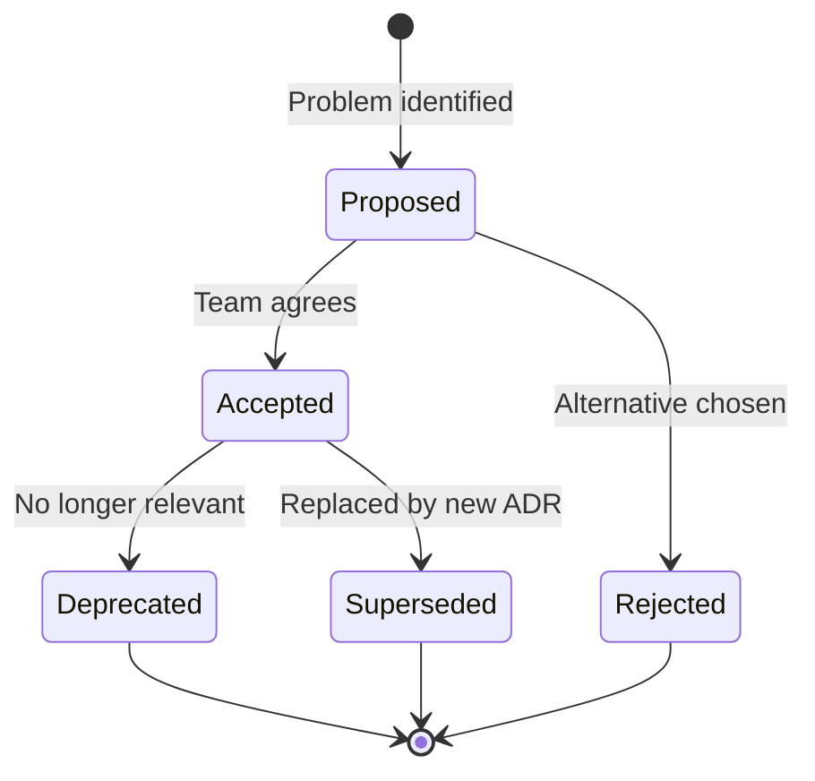

# Architecture Decision Records (ADRs)

This directory contains Architecture Decision Records (ADRs) documenting key architectural decisions made in the Tech Citizen Software Gateway project.

---

## What is an ADR?

An ADR is a document that captures an important architectural decision along with its context and consequences. ADRs help teams:

- **Understand why** decisions were made (not just what was implemented)
- **Track evolution** of architecture over time
- **Onboard new team members** quickly
- **Avoid revisiting** already-decided topics
- **Learn from past decisions** (what worked, what didn't)

---

## ADR Template

We follow this standard structure:

```markdown
# ADR-NNN: [Title]

**Status**: Proposed | Accepted | Deprecated | Superseded  
**Date**: YYYY-MM-DD  
**Decision Makers**: [Names]

## Context

[What problem are we solving? Why is this decision needed?]

## Decision

[What did we decide to do?]

## Consequences

**Positive:** [Benefits of this decision]
**Negative:** [Trade-offs and costs]

## Alternatives Considered

[What other options did we evaluate and why were they rejected?]
```

---

## ADR Index

### Core Architecture

| ADR                                                           | Title                                    | Status      | Date       | Summary                                                                                 |
| ------------------------------------------------------------- | ---------------------------------------- | ----------- | ---------- | --------------------------------------------------------------------------------------- |
| [ADR-001](./ADR-001-gateway-composability-feature-flags.md)   | Gateway Composability with Feature Flags | ✅ Accepted | 2025-12-07 | Feature flags for runtime gateway composition (auth, telemetry, cache, rateLimit)       |
| [ADR-002](./ADR-002-hexagonal-architecture-ports-adapters.md) | Hexagonal Architecture for Auth Package  | ✅ Accepted | 2025-12-07 | Ports & Adapters pattern for authentication (Keycloak/Noop adapters)                    |
| [ADR-003](./ADR-003-gateway-hexagonal-composition.md)         | Gateway Hexagonal Composition            | ✅ Accepted | 2025-12-08 | Complete hexagonal architecture for gateway service (Domain/Application/Infrastructure) |
| [ADR-005](./ADR-005-gateway-package-vs-service.md)            | Gateway as Service vs Package            | ✅ Accepted | 2025-12-13 | YAGNI-driven approach: Keep gateway as service, document extraction roadmap             |

### Infrastructure & Operations

| ADR                                                       | Title                                  | Status      | Date       | Summary                                                              |
| --------------------------------------------------------- | -------------------------------------- | ----------- | ---------- | -------------------------------------------------------------------- |
| [0001](./0001-minimal-infrastructure-yagni.md)            | Minimal Infrastructure (YAGNI)         | ✅ Accepted | 2025-11-XX | Docker Compose over Kubernetes for initial phase                     |
| [0004](./0004-simplified-environment-strategy.md)         | Simplified Environment Strategy        | ✅ Accepted | 2025-11-XX | Development + Production environments (no staging initially)         |
| [ADR-004](./ADR-004-structured-logging-loki-readiness.md) | Structured Logging with Loki Readiness | ✅ Accepted | 2025-12-08 | Phase 1: Pino JSON logging, Phase 2: Loki/Promtail (when production) |

---

## Relationships Between ADRs

```
ADR-001 (Feature Flags)
    ↓
    ├─→ ADR-002 (Auth Hexagonal)  ← Used by gateway
    │       ↓
    └─→ ADR-003 (Gateway Hexagonal)
            ↓
        ADR-005 (Service vs Package)
            ↓
        [Future: Extract gateway-core package]

ADR-004 (Logging)
    ↓
[Future: Loki Stack Implementation]
```

---

## Decision Status Definitions

- **Proposed**: Decision under discussion, not yet implemented
- **Accepted**: Decision approved and implemented
- **Deprecated**: Decision no longer relevant (superseded by newer approach)
- **Superseded**: Explicitly replaced by another ADR (link provided)

---

## When to Write an ADR

Create an ADR when:

1. **Architectural Pattern**: Introducing new architecture pattern (hexagonal, event-driven, etc.)
2. **Technology Choice**: Selecting framework, library, or tool that affects multiple components
3. **Infrastructure Decision**: Database, cache, message broker, observability stack choices
4. **Trade-off Resolution**: Deciding between competing approaches with significant trade-offs
5. **Anti-Pattern Awareness**: Documenting what NOT to do and why

Do NOT create ADR for:

- ❌ Implementation details (how to write a function)
- ❌ Temporary workarounds (document in code comments)
- ❌ Obvious choices with no alternatives (use standard tools)
- ❌ Reversible decisions without architectural impact

---

## ADR Lifecycle



---

## How to Use ADRs

### For New Team Members

1. Read ADRs in chronological order (oldest first)
2. Focus on **Context** and **Consequences** sections
3. Note **superseded** ADRs (understand evolution)

### For Developers

1. Reference ADR number in commit messages: `feat(gateway): add cache layer (ADR-001)`
2. Update ADR if implementation deviates from decision
3. Link ADR in code comments for complex patterns

### For Architects

1. Review ADRs quarterly for relevance
2. Mark deprecated ADRs when architecture evolves
3. Create new ADR when significant deviation from existing decision

---

## Contributing

To propose a new ADR:

1. **Copy template** from `.github/ADR-TEMPLATE.md`
2. **Number sequentially**: Next available ADR-NNN number
3. **Fill all sections**: Especially Context, Alternatives, Consequences
4. **Get review**: From at least 2 team members
5. **Update this index**: Add row to appropriate table
6. **Set status**: Start as "Proposed", change to "Accepted" after approval

---

## Related Documentation

- [Architecture Overview](../README.md) - High-level system architecture
- [Project Roadmap](../../project/ROADMAP.md) - Feature development timeline
- [Copilot Instructions](../../../.github/copilot-instructions.md) - Coding standards and patterns

---

**Last Updated**: 2025-12-13  
**Maintained By**: Antonio Cittadino
