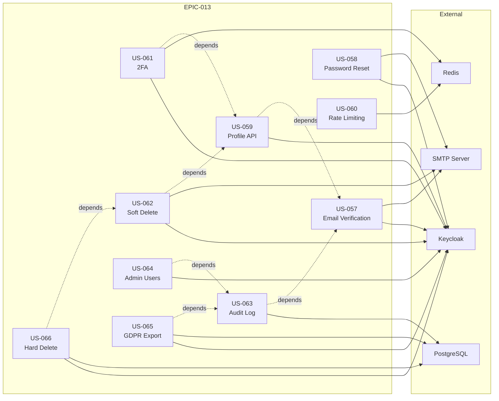
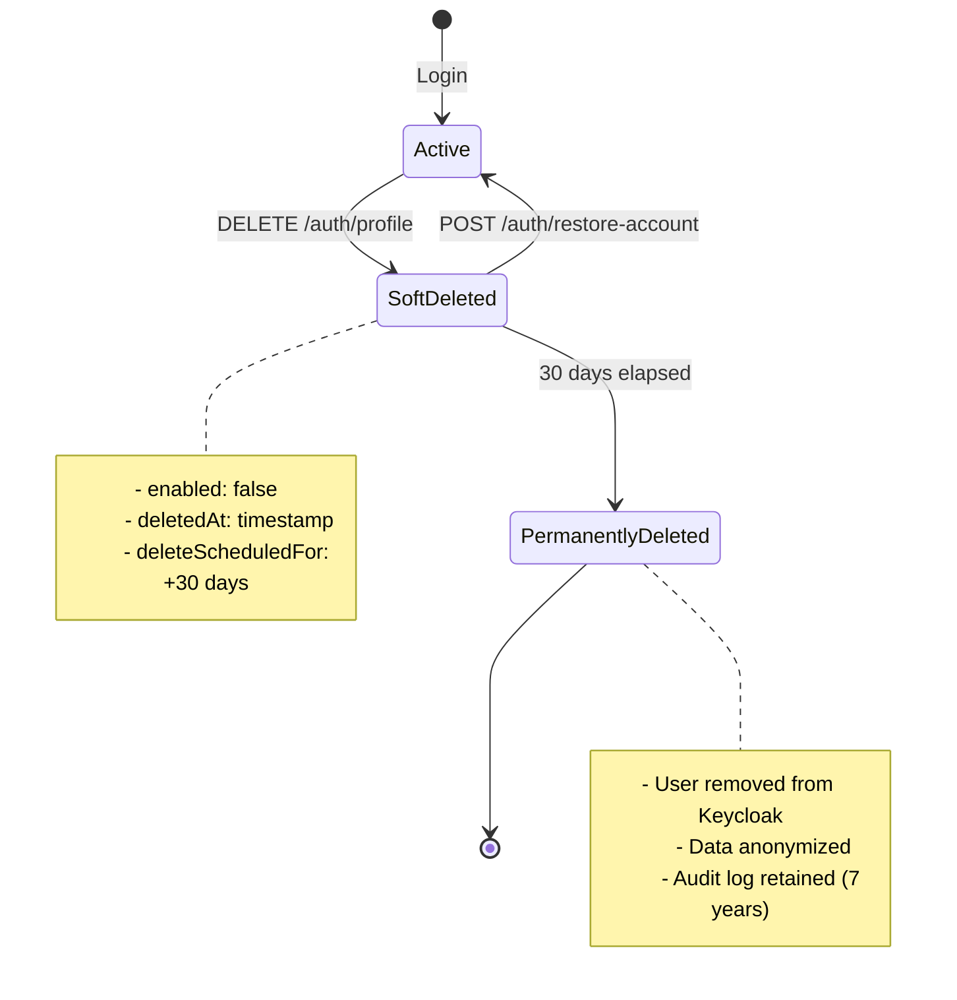

# EPIC-013: User Lifecycle Management

**Project**: Tech Citizen Software Gateway  
**Epic Owner**: Antonio Cittadino  
**Created**: 2025-12-11  
**Target Version**: v1.8.0 → v2.0.0  
**Status**: Planning

---

## Epic Overview

### Vision Statement

> As a **Healthcare Professional**, I want a **complete, secure account lifecycle** so that I can **register, authenticate, manage my profile, and control my data** in compliance with GDPR and healthcare regulations.

### Business Value

| Metric              | Current | Target       | Impact                 |
| ------------------- | ------- | ------------ | ---------------------- |
| User self-service   | 0%      | 95%          | Reduce support tickets |
| Security compliance | Partial | OWASP Top 10 | Risk mitigation        |
| GDPR compliance     | 20%     | 100%         | Legal requirement      |
| 2FA adoption        | 0%      | 60%          | Enhanced security      |

### Scope

**In Scope**:

- Email verification flow
- Password reset flow
- Profile management (CRUD)
- Two-Factor Authentication (TOTP)
- Account deletion (soft + hard)
- Audit logging
- Admin user management
- Rate limiting & CORS

**Out of Scope**:

- Social login (OAuth providers)
- Biometric authentication
- Single Sign-On (SSO) federation
- Custom roles management UI

### Dependencies



---

## Implementation Phases

### Phase 1: MVP (Sprint 3 - v1.8.0)

| Story     | Title                   | Points    | Priority |
| --------- | ----------------------- | --------- | -------- |
| US-057    | Email Verification Flow | 5 SP      | P0       |
| US-058    | Password Reset Flow     | 3 SP      | P0       |
| US-059    | Profile Management API  | 5 SP      | P0       |
| US-060    | Rate Limiting + CORS    | 4 SP      | P0       |
| **Total** |                         | **17 SP** |          |

### Phase 2: Enhanced Security (Sprint 4 - v1.9.0)

| Story     | Title                  | Points    | Priority |
| --------- | ---------------------- | --------- | -------- |
| US-061    | 2FA Setup & Validation | 8 SP      | P1       |
| US-062    | Soft Delete + Restore  | 5 SP      | P1       |
| US-063    | Audit Log API          | 3 SP      | P1       |
| **Total** |                        | **16 SP** |          |

### Phase 3: Admin & Compliance (Sprint 5 - v2.0.0)

| Story     | Title                 | Points    | Priority |
| --------- | --------------------- | --------- | -------- |
| US-064    | Admin User Management | 8 SP      | P2       |
| US-065    | GDPR Data Export      | 3 SP      | P2       |
| US-066    | Hard Delete Cron Job  | 2 SP      | P2       |
| **Total** |                       | **13 SP** |          |

---

## User Stories

---

### US-057: Email Verification Flow

**Epic**: EPIC-013 User Lifecycle Management  
**Sprint**: 3  
**Points**: 5 SP  
**Priority**: P0 - Blocker for UI

#### Story

> As a **newly registered user**,  
> I want to **verify my email address via a secure link**,  
> So that I can **prove ownership and activate my account**.

#### Acceptance Criteria (BDD)

```gherkin
Feature: Email Verification Flow
  As a newly registered user
  I want to verify my email address
  So that I can activate my account and login

  Background:
    Given the email service is configured
    And Keycloak is running
    And the verification token expiry is set to 7 days

  # Happy Path
  @happy-path @smoke
  Scenario: Successful email verification
    Given a user "mario.rossi@hospital.it" has registered
    And the user has not verified their email
    When the user clicks the verification link in their email
    Then the system should validate the JWT token
    And the user's emailVerified status should be "true" in Keycloak
    And the user should be redirected to "/login?verified=true"
    And an audit log entry "EMAIL_VERIFIED" should be created

  @happy-path
  Scenario: Successful verification email sending
    Given a new user submits registration with email "nuovo@hospital.it"
    When the registration is successful
    Then an email should be sent to "nuovo@hospital.it"
    And the email should contain a verification link
    And the link should contain a valid JWT token
    And the token should expire in 7 days

  # Idempotency
  @edge-case
  Scenario: Clicking verification link twice (idempotent)
    Given a user "mario.rossi@hospital.it" has already verified their email
    When the user clicks the verification link again
    Then the system should return HTTP 200
    And no error should be displayed
    And the user should be redirected to "/login?verified=true"

  # Error Cases
  @error-handling
  Scenario: Expired verification token
    Given a user registered more than 7 days ago
    And the user has not verified their email
    When the user clicks the verification link
    Then the system should return HTTP 400
    And the response should contain error code "AUTH_TOKEN_EXPIRED"
    And the user should see a "Resend Verification Email" button

  @error-handling
  Scenario: Invalid verification token
    When a request is made with an invalid token "malformed-token-xyz"
    Then the system should return HTTP 401
    And the response should contain error code "AUTH_TOKEN_INVALID"

  @error-handling
  Scenario: Tampered verification token
    Given a valid token exists for user "mario.rossi@hospital.it"
    When a request is made with a token signed by a different key
    Then the system should return HTTP 401
    And the response should contain error code "AUTH_TOKEN_INVALID"

  # Resend Flow
  @resend
  Scenario: Resend verification email
    Given a user "mario.rossi@hospital.it" has not verified their email
    When the user requests to resend the verification email
    Then a new verification token should be generated
    And a new email should be sent
    And the previous token should still work (no invalidation)

  @rate-limiting
  Scenario: Rate limit on resend verification
    Given a user has requested verification email 3 times in the last hour
    When the user requests another verification email
    Then the system should return HTTP 429
    And the response should contain "retry_after" header
```

#### Technical Notes

- **Endpoint**: `POST /auth/verify-email?token=<JWT>`
- **Endpoint**: `POST /auth/resend-verification` (body: `{ email: string }`)
- **Token payload**: `{ userId, email, type: 'email_verification', exp }`
- **Keycloak update**: Set `emailVerified: true`

#### Definition of Done

- [ ] Endpoints implemented and tested
- [ ] Unit tests: 90% coverage
- [ ] Integration tests with Keycloak
- [ ] E2E test: register → verify → login
- [ ] Email template created (HTML + plain text)
- [ ] Audit logging implemented
- [ ] API documentation updated

---

### US-058: Password Reset Flow

**Epic**: EPIC-013 User Lifecycle Management  
**Sprint**: 3  
**Points**: 3 SP  
**Priority**: P0 - Blocker for UI

#### Story

> As a **user who forgot my password**,  
> I want to **reset it via a secure email link**,  
> So that I can **regain access to my account**.

#### Acceptance Criteria (BDD)

```gherkin
Feature: Password Reset Flow
  As a user who forgot my password
  I want to reset it securely
  So that I can regain access to my account

  Background:
    Given the email service is configured
    And Keycloak is running
    And the reset token expiry is set to 1 hour

  # Request Reset
  @happy-path @smoke
  Scenario: Request password reset for existing user
    Given a verified user "mario.rossi@hospital.it" exists
    When the user requests a password reset
    Then the system should return HTTP 200
    And the response should say "If email exists, reset link sent"
    And an email with reset link should be sent
    And an audit log entry "PASSWORD_RESET_REQUESTED" should be created

  @security
  Scenario: Request password reset for non-existent email
    Given no user with email "unknown@hospital.it" exists
    When a password reset is requested for "unknown@hospital.it"
    Then the system should return HTTP 200
    And the response should say "If email exists, reset link sent"
    And no email should be sent
    And no error should reveal if email exists

  # Complete Reset
  @happy-path
  Scenario: Complete password reset with valid token
    Given a user has requested a password reset
    And the user has a valid reset token
    When the user submits a new password "NewSecure@Pass123"
    Then the system should return HTTP 200
    And the password should be updated in Keycloak
    And all existing sessions should be invalidated
    And an email notification "Password changed" should be sent
    And an audit log entry "PASSWORD_RESET" should be created
    And the user should be redirected to "/login?password_reset=true"

  @validation
  Scenario: Password reset with weak password
    Given a user has a valid reset token
    When the user submits password "weak"
    Then the system should return HTTP 400
    And the response should contain error code "VAL_WEAK_PASSWORD"
    And the response should include password requirements

  @validation
  Scenario: Password reset with recently used password
    Given a user has a valid reset token
    And the user's password history contains "PreviousPass@123"
    When the user submits password "PreviousPass@123"
    Then the system should return HTTP 400
    And the response should contain error code "VAL_PASSWORD_IN_HISTORY"

  # Token Errors
  @error-handling
  Scenario: Expired reset token
    Given a reset token was generated 2 hours ago
    When the user tries to reset password with this token
    Then the system should return HTTP 400
    And the response should contain error code "AUTH_TOKEN_EXPIRED"

  @error-handling
  Scenario: Already used reset token
    Given a user has already used their reset token
    When the user tries to use the same token again
    Then the system should return HTTP 400
    And the response should contain error code "AUTH_TOKEN_ALREADY_USED"

  # Rate Limiting
  @rate-limiting
  Scenario: Rate limit on password reset requests
    Given a user has requested 3 password resets in the last hour
    When the user requests another reset
    Then the system should return HTTP 429
    And the response should contain "retry_after" header
```

#### Technical Notes

- **Endpoint**: `POST /auth/forgot-password` (body: `{ email: string }`)
- **Endpoint**: `POST /auth/reset-password` (body: `{ token, newPassword, confirmPassword }`)
- **Token storage**: Redis with TTL 1 hour, single-use flag
- **Password history**: Check last 5 passwords

#### Definition of Done

- [ ] Endpoints implemented and tested
- [ ] Token single-use enforcement
- [ ] Password history check (last 5)
- [ ] Session invalidation on reset
- [ ] Email notifications (reset link + confirmation)
- [ ] Rate limiting (3 requests/hour)

---

### US-059: Profile Management API

**Epic**: EPIC-013 User Lifecycle Management  
**Sprint**: 3  
**Points**: 5 SP  
**Priority**: P0 - Blocker for UI

#### Story

> As an **authenticated user**,  
> I want to **view and update my profile information**,  
> So that I can **keep my data accurate and change my password**.

#### Acceptance Criteria (BDD)

```gherkin
Feature: Profile Management API
  As an authenticated user
  I want to manage my profile
  So that I can keep my information up to date

  Background:
    Given I am logged in as "mario.rossi@hospital.it"
    And my session is valid

  # View Profile
  @happy-path @smoke
  Scenario: View own profile
    When I request GET /auth/profile
    Then the system should return HTTP 200
    And the response should contain:
      | field         | value                    |
      | id            | <uuid>                   |
      | email         | mario.rossi@hospital.it  |
      | firstName     | Mario                    |
      | lastName      | Rossi                    |
      | emailVerified | true                     |
      | roles         | ["practitioner"]         |
    And the response should contain "createdAt" timestamp
    And the response should contain "lastLogin" timestamp

  # Update Profile
  @happy-path
  Scenario: Update profile basic fields
    When I submit PATCH /auth/profile with:
      | field      | value        |
      | firstName  | Mario        |
      | lastName   | Rossi        |
      | phone      | +39333123456 |
      | department | Cardiology   |
    Then the system should return HTTP 200
    And the profile should be updated in Keycloak
    And an audit log entry "PROFILE_UPDATED" should be created
    And the audit log should contain the changed fields

  @validation
  Scenario: Update profile with invalid phone format
    When I submit PATCH /auth/profile with phone "invalid"
    Then the system should return HTTP 400
    And the response should contain error code "VAL_INVALID_FORMAT"
    And the error should specify field "phone"

  # Change Password
  @happy-path
  Scenario: Change password successfully
    When I submit POST /auth/change-password with:
      | field           | value             |
      | currentPassword | OldPass@123       |
      | newPassword     | NewSecure@456     |
      | confirmPassword | NewSecure@456     |
    Then the system should return HTTP 200
    And my password should be updated in Keycloak
    And all my other sessions should be invalidated
    And I should receive a "Password changed" email
    And an audit log entry "PASSWORD_CHANGED" should be created

  @error-handling
  Scenario: Change password with wrong current password
    When I submit POST /auth/change-password with wrong current password
    Then the system should return HTTP 401
    And the response should contain error code "AUTH_INVALID_CREDENTIALS"

  @validation
  Scenario: Change password with same as current
    When I submit POST /auth/change-password with:
      | currentPassword | SamePass@123 |
      | newPassword     | SamePass@123 |
    Then the system should return HTTP 400
    And the response should contain error code "VAL_PASSWORD_SAME_AS_CURRENT"

  # Concurrent Updates
  @concurrency
  Scenario: Concurrent profile update conflict
    Given another session has updated my profile
    When I submit PATCH /auth/profile without the latest ETag
    Then the system should return HTTP 409
    And the response should contain error code "RES_CONCURRENT_UPDATE"
    And the response should include the current profile data

  # Session Expiry
  @error-handling
  Scenario: Access profile with expired session
    Given my session has expired
    When I request GET /auth/profile
    Then the system should return HTTP 401
    And the response should contain error code "AUTH_SESSION_EXPIRED"
```

#### Technical Notes

- **Endpoints**:
  - `GET /auth/profile`
  - `PATCH /auth/profile`
  - `POST /auth/change-password`
- **Concurrency**: Use ETag header for optimistic locking
- **Sensitive fields**: Cannot change email without re-verification

#### Definition of Done

- [ ] GET /auth/profile implemented
- [ ] PATCH /auth/profile with validation
- [ ] POST /auth/change-password with history check
- [ ] ETag-based concurrency control
- [ ] Session invalidation on password change
- [ ] Audit logging for all mutations

---

### US-060: Rate Limiting + CORS

**Epic**: EPIC-013 User Lifecycle Management  
**Sprint**: 3  
**Points**: 4 SP  
**Priority**: P0 - Security Critical

#### Story

> As a **system operator**,  
> I want **rate limiting and CORS protection**,  
> So that I can **prevent abuse and ensure secure cross-origin requests**.

#### Acceptance Criteria (BDD)

```gherkin
Feature: Rate Limiting and CORS Protection
  As a system operator
  I want to protect APIs from abuse
  So that the system remains secure and available

  # Rate Limiting
  @rate-limiting @smoke
  Scenario: Rate limit on login attempts
    Given the login rate limit is 5 attempts per 15 minutes
    When a client makes 6 login attempts for the same email
    Then the 6th attempt should return HTTP 429
    And the response should contain "Retry-After" header
    And the response should contain error code "RATE_LIMIT_LOGIN"

  @rate-limiting
  Scenario: Rate limit on registration
    Given the registration rate limit is 5 per hour per IP
    When a client from IP "192.168.1.100" makes 6 registration requests
    Then the 6th request should return HTTP 429
    And an alert should be logged for potential abuse

  @rate-limiting
  Scenario: Rate limit on password reset
    Given the password reset rate limit is 3 per hour
    When a client requests 4 password resets for "test@hospital.it"
    Then the 4th request should return HTTP 429

  @rate-limiting
  Scenario: Rate limit counter reset after window
    Given a client has hit the login rate limit
    When 15 minutes have passed
    Then the client should be able to attempt login again

  # CORS
  @cors @smoke
  Scenario: CORS allows configured origins
    Given the allowed origin is "https://app.techcitizen.it"
    When a preflight request comes from "https://app.techcitizen.it"
    Then the response should include header "Access-Control-Allow-Origin: https://app.techcitizen.it"
    And the response should include header "Access-Control-Allow-Credentials: true"
    And the response should include header "Access-Control-Allow-Methods: GET, POST, PATCH, DELETE, OPTIONS"

  @cors
  Scenario: CORS blocks unauthorized origins
    Given the allowed origin is "https://app.techcitizen.it"
    When a request comes from "https://evil.com"
    Then the response should NOT include "Access-Control-Allow-Origin" header
    And the request should be rejected

  @cors
  Scenario: CORS handles preflight requests
    When an OPTIONS request is made to "/auth/login"
    Then the response should be HTTP 204
    And the response should include appropriate CORS headers
    And no authentication should be required

  # Combined Security
  @security
  Scenario: Rate limiting with distributed Redis
    Given Redis is configured for rate limiting
    When requests come from multiple gateway instances
    Then rate limits should be shared across instances
    And the total count should not exceed the limit
```

#### Technical Notes

- **Rate Limiting Storage**: Redis with sliding window
- **Rate Limits**:
  - Login: 5 attempts / 15 min per email
  - Registration: 5 / hour per IP
  - Password reset: 3 / hour per email
  - General API: 100 req / min per user
- **CORS Whitelist**: Configured via environment variable

#### Definition of Done

- [ ] Rate limiting middleware implemented
- [ ] Redis-based counter with sliding window
- [ ] CORS middleware with whitelist
- [ ] Preflight handling for all routes
- [ ] Prometheus metrics for rate limit hits
- [ ] Alert on potential abuse patterns

---

### US-061: Two-Factor Authentication (2FA)

**Epic**: EPIC-013 User Lifecycle Management  
**Sprint**: 4  
**Points**: 8 SP  
**Priority**: P1 - Enhanced Security

#### Story

> As a **security-conscious user**,  
> I want to **enable TOTP-based two-factor authentication**,  
> So that I can **add an extra layer of security to my account**.

#### Acceptance Criteria (BDD)

```gherkin
Feature: Two-Factor Authentication (2FA)
  As a security-conscious user
  I want to enable 2FA on my account
  So that my account is more secure

  Background:
    Given I am logged in as "mario.rossi@hospital.it"
    And 2FA is not currently enabled

  # Setup 2FA
  @happy-path @smoke
  Scenario: Start 2FA setup
    When I request POST /auth/2fa/setup
    Then the system should return HTTP 200
    And the response should contain:
      | field       | description                    |
      | secret      | Base32 TOTP secret             |
      | qrCodeUrl   | otpauth:// URL for QR code     |
      | backupCodes | Array of 10 backup codes       |
    And the setup should be stored temporarily in Redis
    And the setup should expire in 10 minutes

  @happy-path
  Scenario: Verify 2FA setup with valid code
    Given I have started 2FA setup
    And I have scanned the QR code with my authenticator app
    When I submit POST /auth/2fa/verify with a valid TOTP code
    Then the system should return HTTP 200
    And 2FA should be enabled on my account
    And an audit log entry "2FA_ENABLED" should be created
    And I should receive a "2FA Enabled" email

  @error-handling
  Scenario: Verify 2FA setup with invalid code
    Given I have started 2FA setup
    When I submit POST /auth/2fa/verify with code "000000"
    Then the system should return HTTP 401
    And the response should contain error code "AUTH_2FA_INVALID_CODE"

  @error-handling
  Scenario: 2FA setup timeout
    Given I started 2FA setup 11 minutes ago
    When I submit POST /auth/2fa/verify
    Then the system should return HTTP 400
    And the response should contain error code "AUTH_2FA_SETUP_EXPIRED"

  # Login with 2FA
  @happy-path
  Scenario: Login with 2FA enabled
    Given I have 2FA enabled on my account
    When I submit valid username and password
    Then the system should return HTTP 200
    And the response should contain:
      | field       | value |
      | requires2FA | true  |
      | tempToken   | JWT   |
    When I submit POST /auth/2fa/validate with valid TOTP code
    Then I should be logged in successfully
    And a session should be created

  @error-handling
  Scenario: Login with wrong 2FA code
    Given I have 2FA enabled
    And I have submitted valid credentials
    When I submit POST /auth/2fa/validate with wrong code 3 times
    Then my account should be locked for 15 minutes
    And an audit log entry "ACCOUNT_LOCKED" should be created

  # Backup Codes
  @backup-codes
  Scenario: Login with backup code
    Given I have 2FA enabled
    And I have lost access to my authenticator
    When I use one of my backup codes to login
    Then I should be logged in successfully
    And the backup code should be marked as used
    And I should see a warning about remaining backup codes

  @backup-codes
  Scenario: Regenerate backup codes
    Given I have 2FA enabled
    When I request POST /auth/2fa/regenerate-codes with my password
    Then new backup codes should be generated
    And old backup codes should be invalidated
    And an audit log entry "2FA_BACKUP_REGENERATED" should be created

  # Disable 2FA
  @disable
  Scenario: Disable 2FA
    Given I have 2FA enabled
    When I submit POST /auth/2fa/disable with my password
    Then 2FA should be disabled on my account
    And my TOTP secret should be removed
    And all backup codes should be invalidated
    And an audit log entry "2FA_DISABLED" should be created
    And I should receive a "2FA Disabled" email
```

#### Technical Notes

- **Endpoints**:
  - `POST /auth/2fa/setup` - Generate TOTP secret + QR code
  - `POST /auth/2fa/verify` - Confirm setup with code
  - `POST /auth/2fa/validate` - Validate code during login
  - `POST /auth/2fa/disable` - Disable 2FA (requires password)
  - `GET /auth/2fa/backup-codes` - View remaining codes
  - `POST /auth/2fa/regenerate-codes` - Generate new backup codes
- **Library**: `speakeasy` for TOTP
- **Backup codes**: 10 codes, 8 chars each, bcrypt hashed

#### Definition of Done

- [ ] TOTP generation and validation
- [ ] QR code URL generation
- [ ] Backup codes (generation, usage, regeneration)
- [ ] Login flow modification for 2FA
- [ ] Disable 2FA with password verification
- [ ] Email notifications
- [ ] Comprehensive test coverage

---

### US-062: Soft Delete + Restore Account

**Epic**: EPIC-013 User Lifecycle Management  
**Sprint**: 4  
**Points**: 5 SP  
**Priority**: P1 - GDPR Compliance

#### Story

> As a **user who wants to delete my account**,  
> I want a **30-day grace period before permanent deletion**,  
> So that I can **restore my account if I change my mind**.

#### Acceptance Criteria (BDD)

```gherkin
Feature: Soft Delete and Restore Account
  As a user
  I want to delete my account with a grace period
  So that I can restore it if I change my mind

  Background:
    Given I am logged in as "mario.rossi@hospital.it"

  # Soft Delete
  @happy-path @smoke
  Scenario: Request account deletion
    When I submit DELETE /auth/profile with:
      | password     | MyCurrentPass@123 |
      | confirmation | DELETE            |
    Then the system should return HTTP 200
    And my account should be marked as "soft deleted"
    And my account should be disabled in Keycloak
    And "deleteScheduledFor" should be set to 30 days from now
    And all my sessions should be invalidated
    And I should receive an "Account Scheduled for Deletion" email
    And the email should contain a restore link
    And an audit log entry "ACCOUNT_SOFT_DELETED" should be created

  @validation
  Scenario: Delete account with wrong password
    When I submit DELETE /auth/profile with wrong password
    Then the system should return HTTP 401
    And my account should NOT be deleted

  @validation
  Scenario: Delete account without confirmation
    When I submit DELETE /auth/profile without confirmation "DELETE"
    Then the system should return HTTP 400
    And the response should contain error code "VAL_CONFIRMATION_MISMATCH"

  # Restore Account
  @happy-path
  Scenario: Restore account within grace period
    Given my account was soft deleted 15 days ago
    When I submit POST /auth/restore-account with valid credentials
    Then the system should return HTTP 200
    And my account should be re-enabled
    And "deletedAt" should be removed
    And "deleteScheduledFor" should be removed
    And I should receive an "Account Restored" email
    And a new session should be created
    And an audit log entry "ACCOUNT_RESTORED" should be created

  @error-handling
  Scenario: Restore account after grace period
    Given my account was soft deleted 31 days ago
    When I submit POST /auth/restore-account
    Then the system should return HTTP 410
    And the response should contain error code "AUTH_ACCOUNT_DELETED"
    And the message should say "Account permanently deleted"

  @error-handling
  Scenario: Login attempt with soft-deleted account
    Given my account was soft deleted 5 days ago
    When I try to login
    Then the system should return HTTP 403
    And the response should contain error code "AUTH_ACCOUNT_DELETED"
    And the response should include restoration instructions

  # Warning Email
  @notification
  Scenario: Warning email before permanent deletion
    Given my account was soft deleted 23 days ago
    When the daily notification job runs
    Then I should receive a "7 Days Until Permanent Deletion" email
    And the email should contain a restore link
```

#### State Diagram



#### Definition of Done

- [ ] DELETE /auth/profile with soft delete
- [ ] POST /auth/restore-account endpoint
- [ ] 30-day grace period enforcement
- [ ] Warning email at 7 days before deletion
- [ ] Session invalidation on delete
- [ ] Audit logging

---

### US-063: Audit Log API

**Epic**: EPIC-013 User Lifecycle Management  
**Sprint**: 4  
**Points**: 3 SP  
**Priority**: P1 - Compliance

#### Story

> As a **user**,  
> I want to **view my account activity log**,  
> So that I can **monitor for unauthorized access**.

#### Acceptance Criteria (BDD)

```gherkin
Feature: Audit Log API
  As a user
  I want to view my account activity
  So that I can monitor for suspicious access

  Background:
    Given I am logged in as "mario.rossi@hospital.it"

  @happy-path @smoke
  Scenario: View own audit log
    When I request GET /auth/audit-log
    Then the system should return HTTP 200
    And the response should contain a paginated list of audit entries
    And each entry should include:
      | field      | description            |
      | id         | Unique entry ID        |
      | eventType  | Type of event          |
      | action     | Action performed       |
      | timestamp  | When it occurred       |
      | ipAddress  | Source IP              |
      | userAgent  | Browser/client info    |
      | success    | Whether action succeeded |

  @pagination
  Scenario: Paginate audit log
    Given I have more than 10 audit entries
    When I request GET /auth/audit-log?page=1&limit=10
    Then the response should contain 10 entries
    And the response should include pagination metadata:
      | field       | description          |
      | totalCount  | Total number of entries |
      | totalPages  | Total pages available   |
      | currentPage | Current page number     |
      | hasNext     | Whether more pages exist |

  @filtering
  Scenario: Filter audit log by event type
    When I request GET /auth/audit-log?eventType=USER_LOGGED_IN
    Then all returned entries should have eventType "USER_LOGGED_IN"

  @filtering
  Scenario: Filter audit log by date range
    When I request GET /auth/audit-log?from=2025-12-01&to=2025-12-11
    Then all returned entries should be within the date range

  @security
  Scenario: Cannot view other user's audit log
    When I try to access audit log for another user
    Then the system should return HTTP 403

  @data
  Scenario: Audit log shows security events
    Given I have performed the following actions:
      | action           |
      | Login            |
      | Profile Update   |
      | Password Change  |
      | Failed Login     |
    When I view my audit log
    Then I should see all these events in reverse chronological order
```

#### Definition of Done

- [ ] GET /auth/audit-log endpoint
- [ ] Pagination support
- [ ] Filtering by event type and date
- [ ] 7-year retention policy
- [ ] PostgreSQL partitioning for performance

---

### US-064: Admin User Management

**Epic**: EPIC-013 User Lifecycle Management  
**Sprint**: 5  
**Points**: 8 SP  
**Priority**: P2 - Admin Tools

#### Story

> As an **administrator**,  
> I want to **manage user accounts (list, suspend, unsuspend)**,  
> So that I can **maintain system security and compliance**.

#### Acceptance Criteria (BDD)

```gherkin
Feature: Admin User Management
  As an administrator
  I want to manage user accounts
  So that I can maintain system security

  Background:
    Given I am logged in as an admin
    And I have the "admin" role

  # List Users
  @happy-path @smoke
  Scenario: List all users with pagination
    When I request GET /admin/users?page=1&limit=20
    Then the system should return HTTP 200
    And the response should contain a paginated list of users
    And each user should include basic profile info and status

  @filtering
  Scenario: Search users by email
    When I request GET /admin/users?search=mario
    Then the response should contain users matching "mario"

  @filtering
  Scenario: Filter users by status
    When I request GET /admin/users?status=suspended
    Then the response should contain only suspended users

  # Suspend User
  @happy-path
  Scenario: Suspend a user account
    Given a user "suspicious@hospital.it" exists and is active
    When I submit POST /admin/users/{userId}/suspend with:
      | reason   | Suspicious activity detected |
      | duration | 7d                           |
    Then the system should return HTTP 200
    And the user should be suspended in Keycloak
    And all user sessions should be invalidated
    And the user should receive a "Account Suspended" email
    And an audit log entry "ACCOUNT_SUSPENDED" should be created

  @error-handling
  Scenario: Suspend already suspended user
    Given a user is already suspended
    When I try to suspend them again
    Then the system should return HTTP 409
    And the response should contain error code "RES_ALREADY_SUSPENDED"

  # Unsuspend User
  @happy-path
  Scenario: Unsuspend a user account
    Given a user "suspended@hospital.it" is suspended
    When I submit POST /admin/users/{userId}/unsuspend
    Then the system should return HTTP 200
    And the user should be re-enabled
    And the user should receive an "Account Reactivated" email
    And an audit log entry "ACCOUNT_UNSUSPENDED" should be created

  # View User Details
  @happy-path
  Scenario: View user details
    When I request GET /admin/users/{userId}
    Then the system should return HTTP 200
    And the response should include:
      | field        | description            |
      | profile      | User profile info      |
      | status       | active/suspended/deleted |
      | sessions     | Active session count   |
      | lastLogin    | Last login timestamp   |
      | auditSummary | Recent activity summary |

  # Authorization
  @security
  Scenario: Non-admin cannot access admin endpoints
    Given I am logged in as a regular user
    When I try to access GET /admin/users
    Then the system should return HTTP 403
```

#### Definition of Done

- [ ] GET /admin/users (list + search + filter)
- [ ] GET /admin/users/:id (details)
- [ ] POST /admin/users/:id/suspend
- [ ] POST /admin/users/:id/unsuspend
- [ ] Role-based access control
- [ ] Audit logging for all admin actions

---

### US-065: GDPR Data Export

**Epic**: EPIC-013 User Lifecycle Management  
**Sprint**: 5  
**Points**: 3 SP  
**Priority**: P2 - GDPR Compliance

#### Story

> As a **user**,  
> I want to **export all my personal data**,  
> So that I can **exercise my GDPR Right to Portability**.

#### Acceptance Criteria (BDD)

```gherkin
Feature: GDPR Data Export
  As a user
  I want to export my personal data
  So that I can exercise my GDPR Right to Portability

  Background:
    Given I am logged in as "mario.rossi@hospital.it"

  @happy-path @smoke
  Scenario: Request data export
    When I submit POST /auth/data-export
    Then the system should return HTTP 202 Accepted
    And a background job should be queued
    And I should receive a confirmation email
    And an audit log entry "DATA_EXPORT_REQUESTED" should be created

  @happy-path
  Scenario: Download data export
    Given I requested a data export 1 hour ago
    And the export is ready
    When I request GET /auth/data-export/{exportId}
    Then the system should return HTTP 200
    And the response should be a JSON file containing:
      | section     | content                    |
      | profile     | All profile information    |
      | sessions    | Login history              |
      | auditLog    | All audit entries          |
      | preferences | User preferences           |
      | metadata    | Export date, format version |

  @notification
  Scenario: Receive notification when export is ready
    Given I requested a data export
    When the export processing is complete
    Then I should receive an email with download link
    And the link should be valid for 7 days

  @security
  Scenario: Export requires password confirmation
    When I submit POST /auth/data-export without password
    Then the system should return HTTP 401
    And data export should not be initiated

  @rate-limiting
  Scenario: Rate limit on data export requests
    Given I requested a data export today
    When I request another export
    Then the system should return HTTP 429
    And the message should say "One export per 24 hours"
```

#### Definition of Done

- [ ] POST /auth/data-export endpoint
- [ ] Background job for export generation
- [ ] GET /auth/data-export/:id for download
- [ ] JSON export format with all user data
- [ ] Email notification when ready
- [ ] 7-day download link expiry
- [ ] Rate limiting (1 per 24h)

---

### US-066: Hard Delete Cron Job

**Epic**: EPIC-013 User Lifecycle Management  
**Sprint**: 5  
**Points**: 2 SP  
**Priority**: P2 - GDPR Compliance

#### Story

> As a **system operator**,  
> I want **automatic permanent deletion of expired soft-deleted accounts**,  
> So that **GDPR Right to Erasure is enforced**.

#### Acceptance Criteria (BDD)

```gherkin
Feature: Hard Delete Cron Job
  As a system operator
  I want automatic permanent deletion of soft-deleted accounts
  So that GDPR compliance is maintained

  Background:
    Given the hard delete cron job is configured to run daily at 2 AM

  @happy-path @smoke
  Scenario: Delete expired accounts
    Given the following soft-deleted accounts exist:
      | email                  | deleteScheduledFor |
      | expired@hospital.it    | 2025-12-10         |
      | notyet@hospital.it     | 2025-12-15         |
    And today is 2025-12-11
    When the hard delete job runs
    Then "expired@hospital.it" should be permanently deleted
    And "notyet@hospital.it" should NOT be deleted
    And audit log entries "ACCOUNT_HARD_DELETED" should be created
    And a final email should be sent to "expired@hospital.it"

  @data-cleanup
  Scenario: Clean up all user data
    Given an account is permanently deleted
    Then the following should be removed:
      | data type       | storage     |
      | User record     | Keycloak    |
      | Sessions        | Redis       |
      | Personal data   | PostgreSQL  |
    And the following should be retained (anonymized):
      | data type       | retention   |
      | Audit log       | 7 years     |

  @error-handling
  Scenario: Handle deletion failure
    Given an account is due for deletion
    And Keycloak is temporarily unavailable
    When the hard delete job runs
    Then the deletion should be retried 3 times
    And if all retries fail, an alert should be sent to admins
    And the account should be marked for retry next day

  @monitoring
  Scenario: Job execution metrics
    When the hard delete job completes
    Then the following metrics should be recorded:
      | metric                    | value    |
      | accounts_deleted_total    | count    |
      | accounts_failed_total     | count    |
      | job_duration_seconds      | duration |
    And a summary log should be written

  @manual-trigger
  Scenario: Manual job trigger (admin)
    Given I am logged in as an admin
    When I submit POST /system/cleanup-deleted
    Then the hard delete job should run immediately
    And the results should be returned in the response
```

#### Technical Notes

- **Schedule**: Daily at 2:00 AM UTC
- **Query**: `SELECT * FROM users WHERE deleteScheduledFor < NOW()`
- **Retry policy**: 3 attempts with exponential backoff
- **Alerting**: Slack/email on job failure

#### Definition of Done

- [ ] Cron job implementation
- [ ] Keycloak user deletion
- [ ] Redis session cleanup
- [ ] PostgreSQL data anonymization
- [ ] Audit log retention (7 years)
- [ ] Metrics and alerting
- [ ] Manual trigger endpoint

---

## Test Coverage Summary

### Per-Story Coverage Targets

| Story  | Unit | Integration | E2E         | Total |
| ------ | ---- | ----------- | ----------- | ----- |
| US-057 | 90%  | 85%         | 2 scenarios | 88%   |
| US-058 | 90%  | 85%         | 2 scenarios | 88%   |
| US-059 | 90%  | 85%         | 3 scenarios | 88%   |
| US-060 | 85%  | 80%         | 2 scenarios | 83%   |
| US-061 | 85%  | 80%         | 3 scenarios | 83%   |
| US-062 | 90%  | 85%         | 2 scenarios | 88%   |
| US-063 | 85%  | 80%         | 1 scenario  | 83%   |
| US-064 | 85%  | 80%         | 2 scenarios | 83%   |
| US-065 | 85%  | 80%         | 1 scenario  | 83%   |
| US-066 | 90%  | 85%         | 1 scenario  | 88%   |

### BDD Scenario Count

| Feature               | Happy Path | Error  | Edge  | Security | Total  |
| --------------------- | ---------- | ------ | ----- | -------- | ------ |
| Email Verification    | 2          | 3      | 1     | 0        | 6      |
| Password Reset        | 2          | 4      | 0     | 1        | 7      |
| Profile Management    | 3          | 2      | 1     | 0        | 6      |
| Rate Limiting + CORS  | 4          | 0      | 1     | 1        | 6      |
| 2FA                   | 4          | 3      | 0     | 0        | 7      |
| Soft Delete + Restore | 2          | 3      | 0     | 0        | 5      |
| Audit Log             | 2          | 0      | 2     | 1        | 5      |
| Admin Users           | 3          | 1      | 0     | 1        | 5      |
| GDPR Export           | 2          | 0      | 0     | 2        | 4      |
| Hard Delete           | 1          | 1      | 0     | 0        | 2      |
| **Total**             | **25**     | **17** | **5** | **6**    | **53** |

---

## Document History

| Version | Date       | Author            | Changes       |
| ------- | ---------- | ----------------- | ------------- |
| 1.0     | 2025-12-11 | Antonio Cittadino | Initial draft |

---

**Document Status**: Draft - Ready for Review  
**Next Step**: Team review → Sprint planning → Implementation
